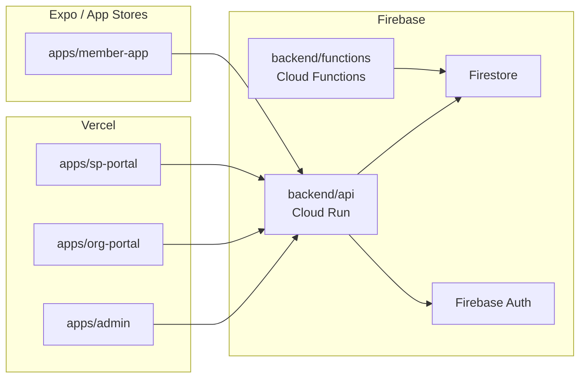

# Planned Monorepo Architecture

## Overview

The production system will be a **pnpm monorepo** managed with Turborepo. The current `welluber-admin` designer repo will be used as the pattern source, not the codebase. Engineers build fresh apps from the spec, sharing code through internal packages.

---

## Repository Structure

```
welluber/                          ← Monorepo root
├── apps/
│   ├── admin/                     ← Host Admin portal (Next.js)
│   ├── org-portal/                ← Org Admin / HR portal (Next.js)
│   ├── sp-portal/                 ← Service Provider portal (Next.js)
│   └── member-app/                ← Member app (React Native / Expo)
│
├── packages/
│   ├── ui/                        ← Shared design system (shadcn base)
│   ├── types/                     ← Shared TypeScript entity types
│   ├── api-client/                ← Typed API client (auto-generated from spec)
│   ├── auth/                      ← Firebase multi-tenant auth helpers
│   └── config/                    ← Shared ESLint, Prettier, TypeScript configs
│
├── backend/
│   ├── api/                       ← REST API (Node.js + Hono)
│   ├── firestore/                  ← Collection schemas + security rules
│   └── functions/                  ← Firebase Cloud Functions
│
├── turbo.json
├── pnpm-workspace.yaml
└── package.json
```

---

## App Boundaries

### `apps/admin` — Host Portal
**Audience:** WellUber internal team  
**Auth:** Firebase tenant `host`  
**Key Features:**
- Platform configuration (taxonomy, commission, cron settings)
- Org and SP onboarding
- Global policy management
- Settlement and payout trigger
- System-wide analytics

**Routes to build:** See [pages/PAGE_INVENTORY.md](../pages/PAGE_INVENTORY.md) — all routes under `(host)` group

---

### `apps/org-portal` — Organization Portal
**Audience:** HR managers and org admins  
**Auth:** Firebase tenant `org-{orgId}`  
**Key Features:**
- Employee management (CSV upload, manual add, edit)
- Policy assignment and eligibility management
- Wallet top-up and balance monitoring
- Utilization dashboard with ring charts
- Employee offboarding

**Routes to build:** See `app/(org)/` stubs in designer repo for initial screen inventory

---

### `apps/sp-portal` — Service Provider Portal
**Audience:** SP admins and branch staff  
**Auth:** Firebase tenant `sp-{spId}`  
**Key Features:**
- Branch management and operating hours
- Voucher creation and lifecycle management
- Walk-in member lookup and claim processing
- Redemption history and revenue view
- Settlement approval

**Routes to build:** See `app/(serviceprovider)/` stubs in designer repo

---

### `apps/member-app` — Member App
**Audience:** Employees (end users)  
**Auth:** Firebase (no tenant — personal accounts)  
**Tech:** React Native + Expo  
**Key Features:**
- Account creation (Google / Apple SSO)
- Corporate identity linking (magic link)
- Marketplace browsing
- Voucher purchase (online payment)
- TOTP code display and redemption
- Benefit wallet and usage history
- Dependent management (v2)

---

## Shared Packages

### `packages/types`
Single source of truth for all TypeScript entity types. Every app and the backend imports from here.

```typescript
// packages/types/src/index.ts
export * from './entities/organization'
export * from './entities/policy'
export * from './entities/provider'
export * from './entities/claims'
export * from './entities/finance'
export * from './entities/user'
export * from './entities/taxonomy'
```

Source: Extract and clean `types/` and `features/*/types.ts` from `welluber-admin`.

---

### `packages/ui`
Shared component library based on shadcn/ui with WellUber design tokens.

```
packages/ui/
├── src/
│   ├── components/           ← Primitives (Button, Input, Card, Badge...)
│   ├── shared/               ← Domain-agnostic shared components
│   │   ├── DataTable
│   │   ├── EmptyState
│   │   ├── StatusBadge
│   │   ├── PulseStatus
│   │   ├── DateRangePicker
│   │   ├── DataFilterBar
│   │   ├── BentoGrid
│   │   └── ... (see COMPONENT_INVENTORY.md)
│   └── tokens/               ← CSS custom properties (OKLCH palette)
└── package.json
```

**Design token source:** `app/globals.css` and `AGENTS.md` in `welluber-admin`.

---

### `packages/auth`
Firebase multi-tenant auth helpers shared between all portals.

```typescript
// packages/auth/src/index.ts
export { initTenantAuth } from './tenant'
export { getSessionUser } from './session'
export { withAuth } from './middleware'  // Next.js middleware helper
export { verifyMagicLink } from './magic-link'
export { generateTOTP, verifyTOTP } from './totp'
export type { WellUberTokenClaims, UserRole, Permission } from './types'
```

---

### `packages/api-client`
Auto-generated typed API client from the OpenAPI spec in `backend/api/`.

```typescript
// Usage in any portal
import { api } from '@welluber/api-client'

const orgs = await api.organizations.list({ status: 'active' })
const policy = await api.policies.create({ ... })
```

---

### `packages/config`
Shared tooling configurations.

```
packages/config/
├── eslint/
│   ├── base.js
│   ├── next.js
│   └── react-native.js
├── prettier/
│   └── index.js
└── typescript/
    ├── base.json
    ├── next.json
    └── react-native.json
```

---

## Backend Structure

### `backend/api` — REST API

```
backend/api/
├── src/
│   ├── routes/
│   │   ├── organizations.ts    ← CRUD + branch management
│   │   ├── employees.ts        ← Employee management, CSV upload
│   │   ├── policies.ts         ← Policy CRUD, versioning, assignment
│   │   ├── providers.ts        ← SP CRUD, branches, vouchers
│   │   ├── claims.ts           ← Claim listing, processing
│   │   ├── accounts.ts         ← Wallet, top-up, transactions
│   │   ├── auth.ts             ← Magic link generation, identity linking
│   │   ├── purchases.ts        ← Voucher purchase, 3-point validation
│   │   └── settlement.ts       ← Settlement aggregation, payout
│   ├── middleware/
│   │   ├── auth.ts             ← Firebase token verification
│   │   ├── tenant.ts           ← Tenant resolution
│   │   └── permissions.ts      ← Permission checking
│   └── lib/
│       ├── firestore.ts        ← Firestore client
│       ├── commission.ts       ← Commission calculation logic
│       ├── totp.ts             ← TOTP code generation
│       └── settlement.ts       ← Settlement aggregation logic
└── package.json
```

**Stack:** Node.js 22 + Hono (lightweight, TypeScript-first, edge-compatible)

---

### `backend/firestore` — Database Schema

Collection path spec mirrors the entity hierarchy:

```
organizations/{orgId}
  ├── [Organization fields]
  ├── branches/{branchId}
  │     └── [OrganizationBranch fields]
  ├── employees/{empId}
  │     ├── [Employee fields]
  │     └── dependents/{depId}
  │           └── [Dependent fields]
  └── accounts/{accountId}
        ├── [Account fields]
        └── transactions/{txnId}
              └── [AccountTransaction fields]

policies/{policyId}
  ├── [BenefitPolicy fields]
  └── groups/{groupId}
        ├── [BenefitGroup fields]
        └── benefits/{benefitId}
              └── [Benefit fields]

serviceProviders/{spId}
  ├── [ServiceProvider fields]
  ├── branches/{branchId}
  │     └── [SpBranch fields]
  └── vouchers/{voucherId}
        └── [SpVoucher fields]

brands/{brandId}
  └── [Brand fields]

topupTransactions/{txnId}
  └── [TopupTransaction fields]

auditLogs/{logId}
  └── [AuditLogEntry fields]

members/{memberId}
  ├── [WellUber account fields]
  └── corporateIdentities/{identityId}
        └── [Corporate identity, linked orgId + empId]
```

**Denormalization rules:**
- Store `orgName` and `branchName` on `Account` (avoid joins in listing queries)
- Store `voucherName` and `claimId` on `AccountTransaction` (immutable at write time)
- Store commission rates at transaction creation (immutable audit trail)

---

### `backend/functions` — Cloud Functions

| Function | Trigger | Purpose |
|----------|---------|---------|
| `poolRefresh` | Cron (configurable per org FY) | Reset employee benefit pool balances |
| `settlementAggregation` | Cron (monthly) or on-demand | Aggregate SP redemptions for payout period |
| `paymentWebhook` | HTTP (from payment gateway) | Confirm payment, issue TOTP, deduct wallet |
| `magicLinkExpiry` | Cron (every 5 min) | Clean up expired magic link tokens |
| `walletBlocking` | Firestore trigger | Re-check wallet blocking rules on balance change |

---

## Build Tooling

### Turborepo Configuration

```json
// turbo.json
{
  "pipeline": {
    "build": {
      "dependsOn": ["^build"],
      "outputs": [".next/**", "dist/**"]
    },
    "dev": {
      "cache": false,
      "persistent": true
    },
    "lint": {
      "dependsOn": ["^build"]
    },
    "type-check": {
      "dependsOn": ["^build"]
    }
  }
}
```

**Build order:** `packages/*` must build before `apps/*` and `backend/*`.

---

## Environment Variables

| Variable | Used By | Description |
|----------|---------|-------------|
| `FIREBASE_PROJECT_ID` | All | Firebase project identifier |
| `FIREBASE_SERVICE_ACCOUNT_KEY` | Backend | Service account for admin SDK |
| `NEXT_PUBLIC_FIREBASE_CONFIG` | All portals | Client-side Firebase config |
| `API_BASE_URL` | All portals | Backend API URL |
| `PAYMENT_GATEWAY_KEY` | Backend | Payment gateway API key |
| `PAYMENT_GATEWAY_SECRET` | Backend | Payment gateway secret |
| `TOTP_SECRET_SEED` | Backend | Seed for TOTP generation |

---

## Deployment Architecture



**Portals:** Deploy to Vercel (Next.js native platform)  
**API:** Deploy to Google Cloud Run (containerized Hono API)  
**Functions:** Firebase Cloud Functions  
**Member App:** Expo EAS Build → App Store + Google Play
