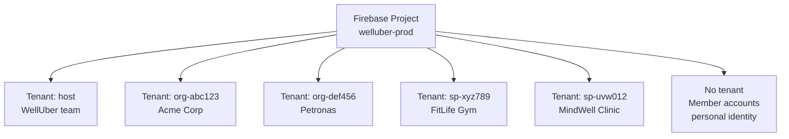
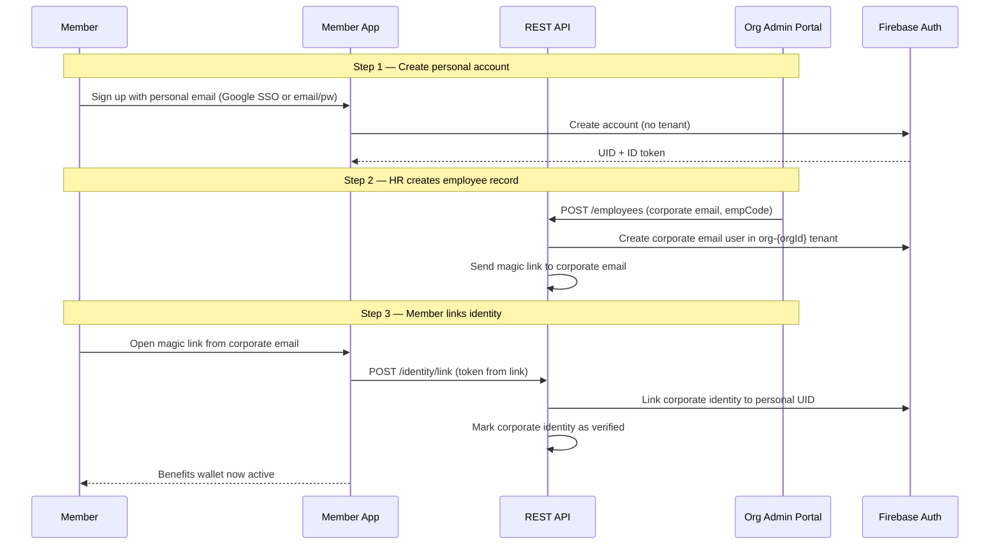
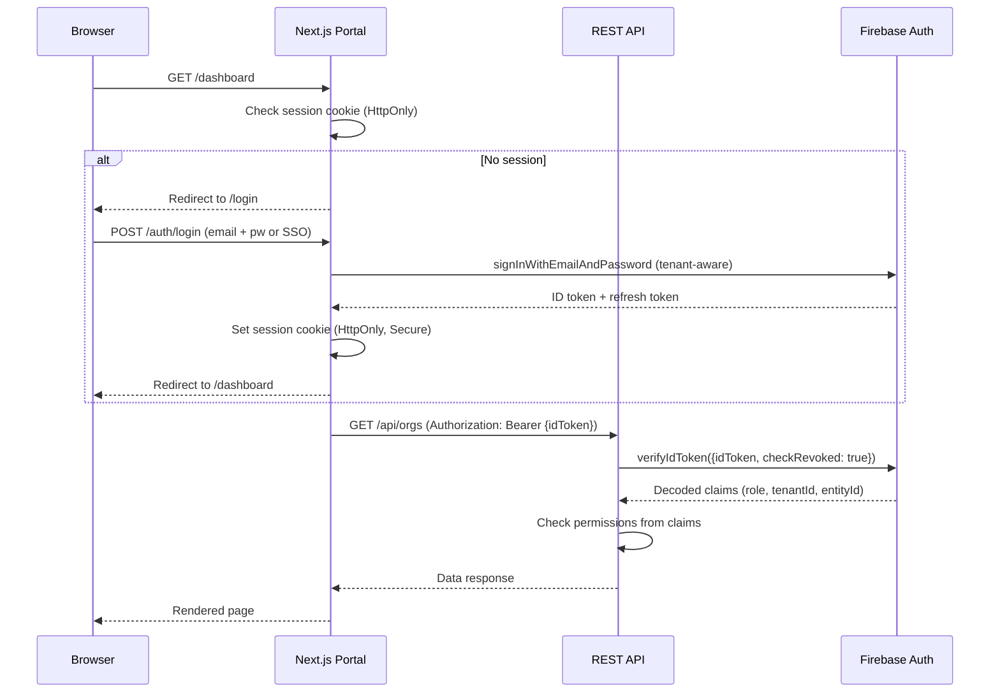

# Multi-Tenancy & Authentication

## Overview

WellUber uses **Firebase Authentication with multi-tenancy** to isolate user sessions between host, organizations, and service providers. One Firebase project hosts all tenants. Each organization and SP gets its own tenant, providing token-level isolation.

---

## Tenant Model



| Tenant Type | ID Format | Who Authenticates Here |
|-------------|-----------|------------------------|
| Host | `host` | WellUber admin team |
| Organization | `org-{orgId}` | Org admins, HR staff |
| Service Provider | `sp-{spId}` | SP admins, branch staff |
| Member | No tenant (default project) | Employees using the Member App |

**Why separate member accounts from tenants?** Members have a permanent personal identity that outlives any employment. Corporate identities (org tenants) are additive — they unlock benefit wallets but do not own the account.

---

## Token Structure

Every authenticated request carries a Firebase ID token (JWT) with custom claims:

```typescript
interface WellUberTokenClaims {
  role: "host_admin" | "org_admin" | "sp_admin" | "sp_staff";
  tenantId: string;          // e.g. "org-abc123"
  entityId: string;          // orgId or spId this user manages
  permissions: Permission[]; // fine-grained permission list
  branchIds?: string[];      // SP staff: only these branches
}

type Permission =
  | "org:read" | "org:write" | "org:delete"
  | "employee:read" | "employee:write"
  | "policy:read" | "policy:write" | "policy:assign"
  | "wallet:read" | "wallet:topup"
  | "sp:read" | "sp:write"
  | "voucher:read" | "voucher:write" | "voucher:redeem"
  | "claim:read" | "claim:process"
  | "settlement:read" | "settlement:approve" | "settlement:trigger"
  | "audit:read"
  | "platform:config"; // host only
```

---

## Role → Permission Mapping

| Role | Permissions |
|------|-------------|
| **host_admin** | All permissions (full platform access) |
| **org_admin** | `org:read/write`, `employee:*`, `policy:read/assign`, `wallet:read/topup`, `claim:read`, `audit:read` |
| **sp_admin** | `sp:read/write`, `voucher:*`, `claim:read`, `settlement:read/approve`, `audit:read` |
| **sp_staff** | `voucher:redeem`, `claim:process` (scoped to assigned `branchIds`) |

---

## Two-Inbox Security Model

Members have two separate email identities to prevent impersonation:



**Security Properties:**
- Personal email account: permanent, never deleted when employment ends
- Corporate identity: deactivated by HR, benefits expire immediately
- Magic link: 60-minute expiry, single-use, invalidated after first use
- Universal link routing: `welluber://verify-identity/[token]` — no browser fallback

---

## Magic Link Specification

| Property | Value |
|----------|-------|
| Delivery method | Email to corporate address |
| Expiry | 60 minutes (strict) |
| Reuse | Single-use only (token invalidated on first click) |
| URL scheme | `welluber://verify-identity/[token]` |
| Fallback | Browser shows redirect message; no in-browser verification |
| Generation | API creates token, stores hash in Firestore with expiry |
| Validation | API checks token hash + expiry before linking identity |

---

## TOTP Voucher Codes

Used to authorize voucher redemption at an SP. Different from auth TOTP — this is a session-scoped code for a purchased voucher.

| Property | Value |
|----------|-------|
| Format | 6-digit numeric |
| Refresh | Every 30 seconds (standard TOTP algorithm, RFC 6238) |
| Validity window | Entire redemption period of the voucher |
| Replay prevention | Blocked by voucher status (`redeemed`), not by code itself |
| Display | Member App shows countdown timer to next refresh |
| SP entry | SP staff enters code in SP Portal or Member presents QR |

---

## Session Flow (Admin Portals)



**Token refresh:** Firebase handles refresh tokens automatically. Session cookies are rotated on each page load (server-side token exchange).

---

## Firestore Security Rules (Tenant Isolation)

```
rules_version = '2';
service cloud.firestore {
  match /databases/{database}/documents {

    // Host tenant: full read/write
    match /{document=**} {
      allow read, write: if request.auth.token.role == 'host_admin';
    }

    // Org admin: own org subtree only
    match /organizations/{orgId}/{document=**} {
      allow read, write: if request.auth.token.entityId == orgId
                        && request.auth.token.role == 'org_admin';
    }

    // SP admin: own SP subtree only
    match /serviceProviders/{spId}/{document=**} {
      allow read, write: if request.auth.token.entityId == spId
                        && request.auth.token.role in ['sp_admin', 'sp_staff'];
    }

    // Members: own account data only
    match /members/{memberId}/{document=**} {
      allow read, write: if request.auth.uid == memberId;
    }
  }
}
```
