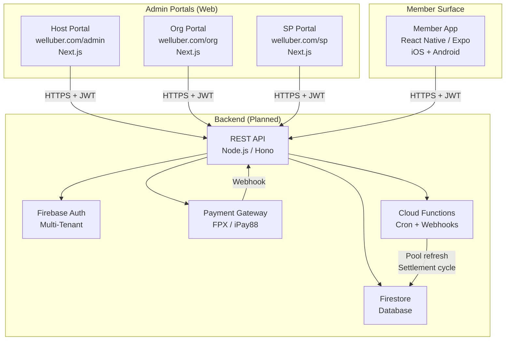
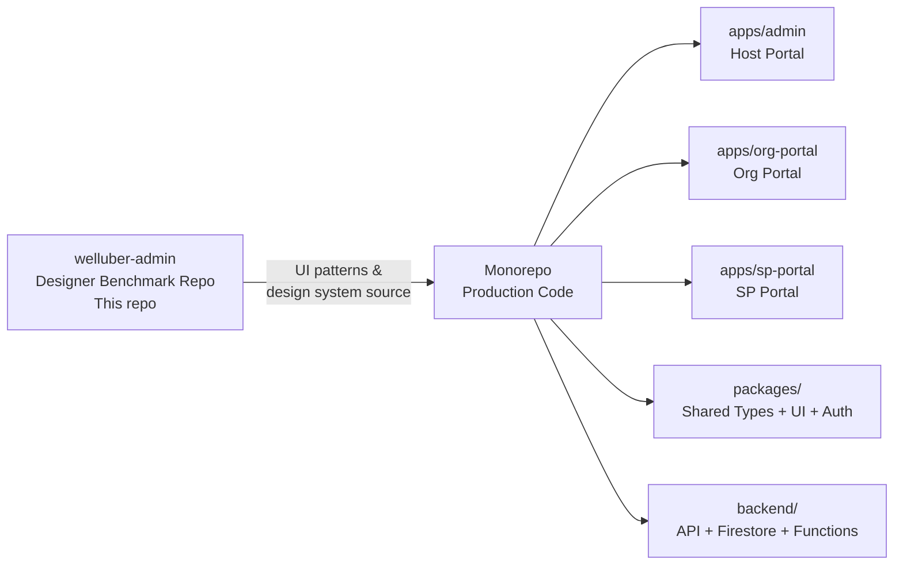
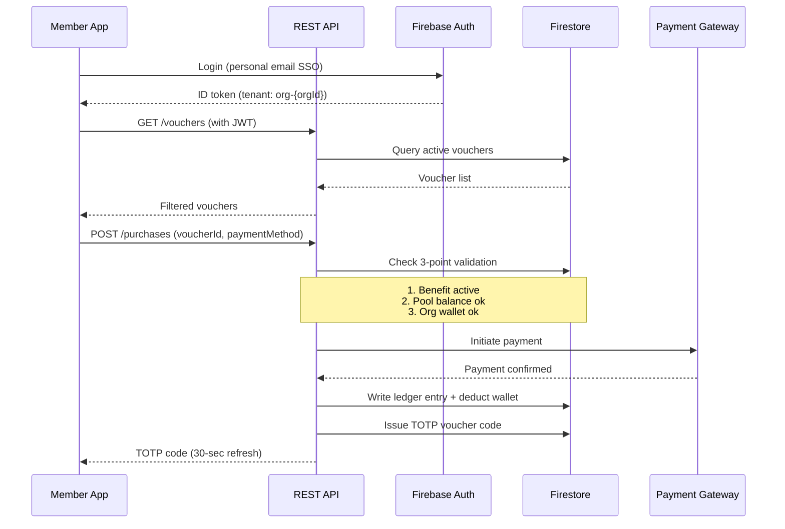

# System Architecture Overview

## What WellUber Is

WellUber is a **B2B2C corporate wellness benefit marketplace** connecting three parties:
- **Organizations (employers)** — fund employee benefit wallets
- **Service Providers** — deliver wellness services and redeem payment
- **Members (employees)** — browse, purchase, and redeem vouchers

The platform has four distinct surfaces served by three admin portals and one mobile app.

---

## System Map

---

## Actor → Surface Mapping

| Actor | Portal / App | Primary Responsibilities |
|-------|-------------|--------------------------|
| **Host Admin** (WellUber team) | Host Portal | Platform config, onboard orgs + SPs, manage policies, trigger settlement |
| **Org Admin / HR** | Org Portal | Upload employees, assign policies, top-up wallet, view utilization |
| **SP Admin** | SP Portal | Register branches, create vouchers, view redemptions, approve settlement |
| **SP Staff** | SP Portal | Walk-in member lookup, claim processing |
| **Member (Employee)** | Member App | Browse marketplace, purchase vouchers, redeem at SP |

---

## This Repo's Role

**`welluber-admin` is NOT production code.** It is:
- A complete UI reference built by the designer using AI tools
- The source of truth for visual design, component patterns, and user flows
- The input to the `.docs_technical/` spec hub (this folder)

When building the production system, extract:
- Design system tokens from `app/globals.css` and `AGENTS.md`
- TypeScript entity types from `types/` and `features/*/types.ts`
- Component patterns from `components/shared/` and `components/host/`
- Flow logic from this documentation hub

---

## Data Flow: End-to-End Example (Voucher Purchase)

---

## Technology Decisions

| Layer | Technology | Rationale |
|-------|-----------|-----------|
| Frontend (portals) | Next.js (App Router) | SSR + ISR for admin dashboards, React ecosystem |
| Frontend (member) | React Native / Expo | iOS + Android from one codebase |
| Backend API | Node.js + Hono (planned) | Lightweight, TypeScript-first, edge-compatible |
| Auth | Firebase Auth (multi-tenant) | Built-in multi-tenancy, magic links, Google SSO |
| Database | Firestore | Real-time sync, hierarchical data model fits entity tree |
| Functions | Firebase Cloud Functions | Cron jobs (pool refresh, settlement), webhook handlers |
| Payment | FPX / iPay88 (TBD) | Malaysian payment rails |
| Monorepo tooling | Turborepo + pnpm | Fast builds, shared packages, workspace support |

---

## Current State vs. Target State

| Aspect | Current (this repo) | Target (production) |
|--------|--------------------|--------------------|
| Auth | Stub session (`lib/session.ts`) | Firebase multi-tenant JWT |
| Data | Mock in-memory store | Firestore |
| API | Server Actions (simulate delays) | REST API (Node.js/Hono) |
| Portals | Single Next.js app (route groups) | Separate apps in monorepo |
| Member App | Not in this repo | React Native (Expo) |
| Commission | Simulated in mock data | Calculated on-chain at redemption |
| Settlement | Simulated | Firebase Function + payment webhook |
