# Entity Relationship Diagram

> Mermaid `erDiagram` — all WellUber entities and their relationships.
> Render with any Mermaid-compatible viewer (GitHub, mermaid.live, Obsidian).

---

## Full ERD

```mermaid
erDiagram

    %% ─────────────────────────────────────────
    %% ORG DOMAIN
    %% ─────────────────────────────────────────

    Organization {
        string id PK
        string name
        string legalIdentity
        string registrationNumber
        string industry
        string subIndustry
        string type "sme | enterprise | ngo"
        date financialYearStart
        string subscriptionPlan "standard | premium | enterprise"
        string status "active | inactive | draft | deactivated | suspended"
        string tinNumber
        string bankName
        string bankAccountNumber
        string bankAccountName
        number employeeCount
        number utilizationRate
        number totalAccountBalance
        number accountLimit
        number creditLimit
        string picId FK
        string logo
        date createdAt
        date updatedAt
    }

    OrganizationBranch {
        string id PK
        string orgId FK
        string name
        string type "hq | branch"
        string addressLine
        string city
        string state
        string country
        string postalCode
        float lat
        float lon
        string timezone
        boolean active
        number claimsCount
        number utilizationRate
        number balance
        number limit
    }

    Employee {
        string id PK
        string orgId FK
        string branchId FK
        string name
        string email
        string empCode
        string departmentId FK
        string tierId FK
        date dateOfBirth
        string gender "male | female | other"
        string mobileNumber
        date joinDate
        date probationEndDate
        string employmentType "full_time | part_time | contract | internship"
        string status "active | inactive"
        boolean isProbation
    }

    Dependent {
        string id PK
        string employeeId FK
        string name
        string relationship "spouse | child | mother | father | brother | sister | mother_in_law | father_in_law"
        string status "active | inactive"
        date joinDate
    }

    OrganizationAdmin {
        string id PK
        string orgId FK
        string name
        string email
        string role "org_admin"
        string status "active | pending_activation | suspended"
        date invitedAt
    }

    OrgTierConfig {
        string id PK
        string orgId FK
        string name
        string code
    }

    OrgDepartmentConfig {
        string id PK
        string orgId FK
        string name
        string code
    }

    %% ─────────────────────────────────────────
    %% POLICY DOMAIN
    %% ─────────────────────────────────────────

    BenefitPolicy {
        string id PK
        string organizationId FK
        string code
        string name
        string description
        string status "draft | active | deactivated"
        string eligibleEmploymentTypes
        boolean coversDependents
        string benefitPoolType "Individual | Shared"
        string dependentsPoolType "Individual | Shared | SharedWithEmployee"
        string utilisationMode "Fixed | Prorated"
        string prorateUnit "Daily | Weekly | Monthly | Quarterly"
        string refreshCycle "Daily | Weekly | Monthly | Quarterly | Yearly"
        string refreshStartReference "fy_start | join_date | custom_date"
        string activationMode "after_join | after_probation | custom_date"
        number totalCapAmount
        number dependentsCapAmount
        string parentPolicyId FK "null if root version"
        string templateId FK
        string clonedFrom FK
        date createdAt
    }

    BenefitGroup {
        string id PK
        string policyId FK
        string name
        string description
        string distributionType "SharedAmount | IndividualBenefitAmount"
        number maxUsagePerCycle
    }

    Benefit {
        string id PK
        string groupId FK
        string serviceId FK "Tier 2 MainServiceId"
        number amount
        number employeeAmount
        number dependantAmount
        boolean coPaymentRequired
        string coPaymentType "Percentage | Fixed"
        number coPaymentValue
    }

    PolicyTemplate {
        string id PK
        string name
        string tagline
        string icon
    }

    %% ─────────────────────────────────────────
    %% SERVICE PROVIDER DOMAIN
    %% ─────────────────────────────────────────

    Brand {
        string id PK
        string name
        string logo
        string status "active | inactive | removed"
        string serviceCategories
        number assignedSpCount
        date createdAt
        date updatedAt
    }

    ServiceProvider {
        string id PK
        string brandId FK
        string name
        string registrationNo
        string logo
        string status "active | suspended | pending | removed"
        boolean isTaxRegistered
        string taxRegNo
        float taxRate
        string businessType "sdn_bhd | sole_prop | partnership_llp"
        string tinNumber
        string bankName
        string bankAccountNumber
        string bankAccountName
        string addressLine
        string city
        string state
        string country
        number activeVoucherCount
        date createdAt
        date updatedAt
    }

    SpAdmin {
        string id PK
        string spId FK
        string name
        string email
        string status "active | pending_activation"
        date invitedAt
        string branchIds
    }

    SpBranch {
        string id PK
        string spId FK
        string name
        string addressLine
        string city
        string state
        string country
        string postalCode
        float lat
        float lon
        boolean isActive
        float rating
    }

    SpBranchContact {
        string spBranchId FK
        string name
        string email
        string type "branch_manager | staff | reception"
        string phone
        boolean isPublic
    }

    SpVoucher {
        string id PK
        string spId FK
        string code "PAC{SPID}NNNN"
        string name
        string description
        string summary
        string photo
        boolean bookingRequired
        string status "draft | published | activated | paused | ended"
        boolean isActive
        date activationStartDate
        date activationEndDate
        string currency "MYR"
        number initialPrice
        number finalPrice
        string validationUnit "days | months | half_year | year"
        number validationValue
        string redemptionMode "exact_date | after_purchase"
        string membershipStartDay "none | 1st | 15th"
        string branchScope "all | specific"
        date createdAt
        date updatedAt
    }

    ServiceLine {
        string spVoucherId FK
        string service "Tier 2 service name"
        string subServices
        string description
    }

    CommissionSchemaRow {
        string spId FK
        string mainService
        date effectiveFrom
        date lastUpdated
    }

    CommissionTier {
        string commissionSchemaRowId FK
        number limitRedemptions
        float rate "0.0 - 1.0"
    }

    %% ─────────────────────────────────────────
    %% FINANCE DOMAIN
    %% ─────────────────────────────────────────

    Account {
        string id PK
        string orgId FK
        string branchId FK
        string orgName
        string branchName
        string type "new | existing"
        number balance
        number pendingDeductions
        string status "active | suspended | closed"
        date createdAt
        date updatedAt
    }

    AccountTransaction {
        string id PK
        string accountId FK
        string type "topup | deduction | pre-auth | cancelled | reversal | settlement"
        number amount
        number balanceBefore
        number balanceAfter
        string referenceId
        string voucherName
        string claimId FK
        string description
        string performedBy
        date createdAt
    }

    TopupTransaction {
        string id PK
        string orgId FK
        string branchId FK
        string accountId FK
        number amount
        string method "bank_transfer | cheque | cash | credit_card"
        date paidDate
        string status "pending | completed | failed | rejected"
        string remarks
        string attachmentUrl
        string referenceNo
        date createdAt
    }

    %% ─────────────────────────────────────────
    %% CLAIM DOMAIN
    %% ─────────────────────────────────────────

    Claim {
        string id PK
        string employeeId FK
        string accountId FK
        string voucherCode
        string voucherName
        string transactionType "redemption | reimbursement | refund"
        string service
        string provider
        string location
        date date
        number amount
        string status "pre-auth | confirmed | cancelled"
    }

    VoucherRedemption {
        string id PK
        string claimId FK
        string employeeId FK
        string voucherCode
        date date
        string redeemedBy "employee | dependent"
        string redeemedByName
        number amount
        string provider
        string branch
        string city
    }

    GeneratedVoucher {
        string id PK
        string employeeId FK
        string voucherPackageId FK
        string code
        number amount
        string status "active | redeemed | expired | cancelled"
        date generatedAt
        date redeemedAt
        date expiresAt
    }

    %% ─────────────────────────────────────────
    %% USER / AUTH DOMAIN
    %% ─────────────────────────────────────────

    Member {
        string id PK
        string name
        string email
        string type "Employee | Dependent"
        string organizationId FK
        string branchId FK
        string status "Active | Inactive | Pending"
        date joinedDate
        date lastActive
    }

    Administrator {
        string id PK
        string name
        string email
        string role "HostAdmin | OrgAdmin | SPAdmin"
        string entityId FK "orgId or spId"
        string entityType "Organization | ServiceProvider | Platform"
        string status "Active | Inactive"
        date joinedDate
        date lastLogin
    }

    AuditLogEntry {
        string id PK
        string title
        string type "Create | Update | Delete | Approval | Rejection | SettingChange | Login | Payout"
        string desc
        date timestamp
        string updatedByName
        string updatedByEmail
        string entityId FK
        string entityType "Organization | ServiceProvider | Brand | Policy | System"
    }

    %% ─────────────────────────────────────────
    %% SERVICE TAXONOMY
    %% ─────────────────────────────────────────

    ServiceCategory {
        string id PK
        string name "Tier 1"
        string icon
    }

    MainService {
        string id PK
        string categoryId FK
        string name "Tier 2"
    }

    SubService {
        string id PK
        string mainServiceId FK
        string name "Tier 3"
        string description
    }

    %% ─────────────────────────────────────────
    %% RELATIONSHIPS
    %% ─────────────────────────────────────────

    Organization ||--o{ OrganizationBranch : "has"
    Organization ||--o{ Employee : "employs"
    Organization ||--o{ OrganizationAdmin : "has admins"
    Organization ||--o{ Account : "has accounts"
    Organization ||--o{ BenefitPolicy : "owns"
    Organization ||--o{ OrgTierConfig : "has tiers"
    Organization ||--o{ OrgDepartmentConfig : "has departments"

    OrganizationBranch ||--o{ Employee : "contains"
    OrganizationBranch ||--o{ Account : "has account"

    Employee ||--o{ Dependent : "has"
    Employee ||--o{ Claim : "makes"
    Employee ||--o{ GeneratedVoucher : "holds"

    BenefitPolicy ||--o{ BenefitGroup : "contains"
    BenefitPolicy }o--o| BenefitPolicy : "versions (parentPolicyId)"
    BenefitPolicy }o--o| PolicyTemplate : "based on"

    BenefitGroup ||--o{ Benefit : "contains"

    Benefit }o--|| MainService : "references"

    Brand ||--o{ ServiceProvider : "has"

    ServiceProvider ||--o{ SpAdmin : "has team"
    ServiceProvider ||--o{ SpBranch : "has branches"
    ServiceProvider ||--o{ SpVoucher : "has vouchers"
    ServiceProvider ||--o{ CommissionSchemaRow : "has commission"

    SpBranch ||--o{ SpBranchContact : "has contacts"
    SpBranch }o--o{ SpVoucher : "scoped to"

    SpVoucher ||--o{ ServiceLine : "covers"

    CommissionSchemaRow ||--o{ CommissionTier : "has tiers"

    Account ||--o{ AccountTransaction : "has"
    Account ||--o{ TopupTransaction : "has top-ups"

    Claim ||--|| VoucherRedemption : "recorded as"
    Claim ||--|| AccountTransaction : "ledger entry"

    ServiceCategory ||--o{ MainService : "contains"
    MainService ||--o{ SubService : "has"
```

---

## Domain Groupings

| Domain | Entities |
|--------|----------|
| **Org** | Organization, OrganizationBranch, Employee, Dependent, OrganizationAdmin, OrgTierConfig, OrgDepartmentConfig |
| **Policy** | BenefitPolicy, BenefitGroup, Benefit, PolicyTemplate |
| **Provider** | Brand, ServiceProvider, SpAdmin, SpBranch, SpBranchContact, SpVoucher, ServiceLine, CommissionSchemaRow, CommissionTier |
| **Finance** | Account, AccountTransaction, TopupTransaction |
| **Claim** | Claim, VoucherRedemption, GeneratedVoucher |
| **User/Auth** | Member, Administrator, AuditLogEntry |
| **Taxonomy** | ServiceCategory (Tier 1), MainService (Tier 2), SubService (Tier 3) |

---

## Key Cardinalities

| Relationship | Type | Notes |
|-------------|------|-------|
| Organization → BenefitPolicy | 1:N | Each policy belongs to exactly one org |
| BenefitPolicy → BenefitGroup | 1:N | Groups are the container for service allocations |
| BenefitGroup → Benefit | 1:N | One benefit per Tier 2 service |
| Brand → ServiceProvider | 1:N | SP belongs to one brand (franchise) |
| ServiceProvider → SpBranch | 1:N | SP can have many physical locations |
| SpVoucher → SpBranch | M:N | Voucher can be valid at specific or all branches |
| Employee → BenefitPolicy | M:N | Employee can be covered by multiple policies |
| Organization → Account | 1:N | Typically one account per branch |
| Claim → AccountTransaction | 1:1 | Each claim creates an immutable ledger entry |
