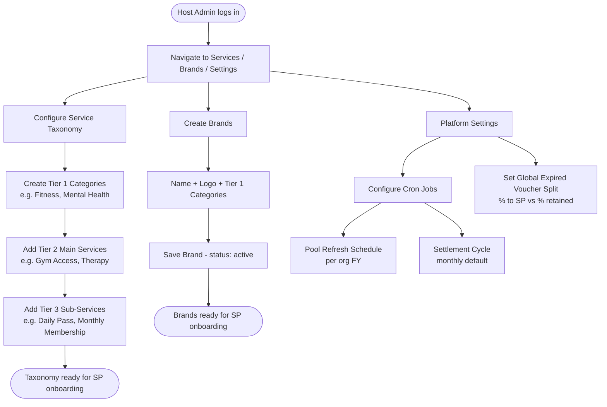

# Flow 0 — Platform Configuration

**Actors:** Host Admin
**Platform:** Host Portal (`/services`, `/settings`, `/brands`)
**Precondition:** Host Admin is authenticated with `host` tenant

---

## Overview

Before any organization or service provider can be onboarded, the Host Admin configures the platform's foundational data: the three-tier service taxonomy, brand registry, global commission defaults, and operational cron settings. This flow is performed once at platform launch and revisited whenever new services or brands need to be added.

---

## Diagram

---

## Steps

1. **[Host Admin] Configure Tier 1 Categories**
   - Navigate to `/services`
   - Create categories (e.g., "Fitness & Exercise", "Mental Health & Mindfulness")
   - Set icon and display order

2. **[Host Admin] Add Tier 2 Main Services**
   - Under each category, create main services
   - Each Tier 2 service gets a canonical `id` (used in `Benefit.serviceId` and `CommissionSchemaRow.mainService`)

3. **[Host Admin] Add Tier 3 Sub-Services**
   - Under each Tier 2 service, add delivery formats
   - Sub-services are informational — used for display and SP voucher configuration

4. **[Host Admin] Create Brands**
   - Navigate to `/brands/new`
   - Enter brand name, logo, and select Tier 1 categories
   - Brand is created with `status: active`

5. **[Host Admin] Configure Settlement Cycle**
   - Navigate to `/settings`
   - Set default settlement cycle (monthly)
   - Enable/disable on-demand settlement trigger

6. **[Host Admin] Configure Expired Voucher Split**
   - Set global `%` of expired voucher value that goes to SP vs. platform retention
   - Stored as platform-wide config; can be overridden per SP in future versions

7. **[Host Admin] Configure Pool Refresh Cron**
   - Set cron schedule for automated pool refresh (typically tied to org FY start)
   - Platform will also allow per-org override at org setup time

---

## Business Rules

- Tier 2 `id` values are immutable once created — they are FKs in Benefit and CommissionSchemaRow
- A brand must exist before an SP can be onboarded
- Taxonomy changes (new Tier 2 services) do not retroactively affect existing policies
- Expired voucher split % applies globally; no per-SP override in v1
- Settlement cycle default is monthly; on-demand trigger available at any time

---

## Error States

| Error | Handling |
|-------|---------|
| Duplicate Tier 2 service name | Validation error — prompt for unique name |
| Brand created with no Tier 1 category | Validation error — at least one category required |
| Settlement cycle already running | Block manual trigger, show status |

---

## Data Written

| Entity | Action |
|--------|--------|
| ServiceCategory | Created for each Tier 1 entry |
| MainService | Created for each Tier 2 entry |
| SubService | Created for each Tier 3 entry |
| Brand | Created with status `active` |
| PlatformConfig | Updated (settlement cycle, expired split %, cron settings) |
| AuditLogEntry | Written for each config change |
