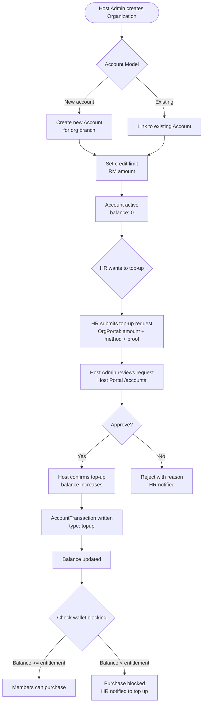

# Flow 1 — Account Management

**Actors:** Host Admin, Org Admin
**Platform:** Host Portal (`/accounts`), Org Portal
**Precondition:** Organization and branch must exist

---

## Overview

Each organization branch has a wallet (Account) that funds employee benefit utilization. Host Admin creates and manages accounts, sets credit limits, and processes top-ups. The Account balance is the gate — if an org wallet runs low, employee purchases are blocked (wallet blocking rule). This flow covers both the initial account setup and ongoing top-up operations.

---

## Diagram

---

## Steps

### Initial Account Setup

1. **[Host Admin] Create account for org branch**
   - Navigate to `/accounts/new` or via org detail page
   - Select organization and branch
   - Choose account type: `new` (fresh account) or `existing` (migrated balance)

2. **[Host Admin] Set credit limit**
   - Enter RM credit limit (overdraft allowance beyond wallet balance)
   - Account created with `status: active`, `balance: 0`

### Top-Up Process

3. **[Org Admin / HR] Submit top-up request**
   - Enter amount, payment method, paid date, reference number
   - Upload payment proof (bank slip, receipt)
   - Top-up status: `pending`

4. **[Host Admin] Review and approve**
   - View pending top-up in `/accounts/[id]`
   - Verify payment proof and amount
   - Approve → balance increases, `TopupTransaction.status: completed`
   - Reject → provide reason, `TopupTransaction.status: rejected`

5. **[System] Write ledger entry**
   - `AccountTransaction` created with type `topup`
   - `balanceBefore` and `balanceAfter` recorded immutably

### Wallet Blocking Rule

6. **[System] Enforce wallet blocking**
   - At voucher purchase time: check if `org_wallet_balance >= member_policy_entitlement`
   - If insufficient: block purchase, surface warning in Org Portal dashboard
   - HR is responsible for maintaining wallet balance above entitlement threshold

### Credit Limit Management

7. **[Host Admin] Adjust credit limit**
   - Navigate to account detail, edit credit limit
   - Can increase or decrease (decrease blocked if current balance would go negative)
   - Change logged in AuditLog

---

## Business Rules

- **Wallet blocking:** `org_wallet_balance < member_policy_entitlement` → purchase blocked
- **Entitlement calculation:** Sum of all active benefit amounts for the employee's assigned policy groups
- **Pending deductions:** Pre-authorized amounts (in-flight purchases) are tracked separately and subtracted from available balance before blocking check
- **Top-up immutability:** Once approved, `AccountTransaction` records cannot be edited — only reversed via a separate `reversal` transaction
- **Credit limit:** Host-granted overdraft allowance. Does not auto-approve purchases beyond it
- **7-year retention:** All `AccountTransaction` records must be retained for tax compliance

---

## Error States

| Error | Handling |
|-------|---------|
| Top-up proof missing | Validation error — proof required before submission |
| Top-up amount exceeds account limit | Warning shown; host can override |
| Wallet balance below entitlement | Purchase blocked; warning surfaced in Org Portal |
| Top-up rejected | HR notified; TopupTransaction status set to `rejected` |
| Account suspended | All purchases blocked; HR cannot top up without Host re-activating |

---

## Data Written

| Entity | Action |
|--------|--------|
| Account | Created on initial setup; balance updated on top-up approval |
| TopupTransaction | Created on HR submission; status updated on host action |
| AccountTransaction | Created on top-up approval (type: `topup`) |
| AuditLogEntry | Written for account creation, credit limit change, top-up approval/rejection |
