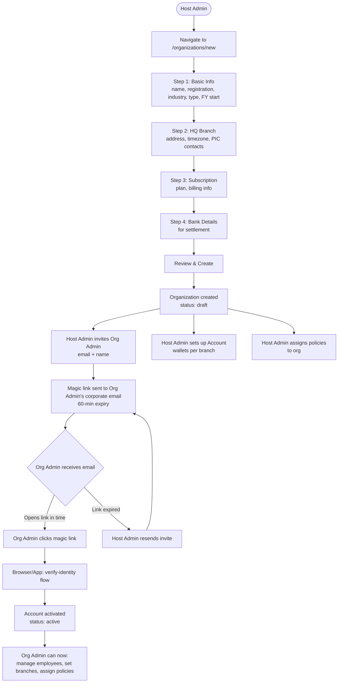

# Flow 2 — Organization Setup

**Actors:** Host Admin, Org Admin (invited)
**Platform:** Host Portal (`/organizations/new`), Org Portal (activation)
**Precondition:** Platform taxonomy configured (Flow 0)

---

## Overview

Host Admin onboards a new corporate client (Organization) by creating the org profile, its HQ branch, and inviting the HR/admin person in charge. Once invited, the Org Admin activates their account via magic link and can begin managing employees and policies.

---

## Diagram

---

## Steps

### Organization Creation

1. **[Host Admin] Basic Info**
   - Name, legal identity, registration number
   - Industry + sub-industry
   - Type: `sme | enterprise | ngo`
   - Financial year start date (used for FY-based refresh cycles)

2. **[Host Admin] HQ Branch**
   - Branch name, full address (with lat/lon optional)
   - Timezone
   - PIC contacts (name, email, phone)

3. **[Host Admin] Subscription**
   - Plan: `standard | premium | enterprise`
   - Billing information
   - Start date / end date (null = ongoing)

4. **[Host Admin] Bank Details**
   - Bank name, account number, account name
   - TIN number
   - Used for settlement reconciliation

5. **[Host Admin] Review and Create**
   - Org created with `status: draft`
   - HQ branch created automatically

6. **[Host Admin] Invite Org Admin**
   - Enter org admin name and corporate email
   - Magic link sent (60-min expiry, single-use)
   - `OrganizationAdmin` created with `status: pending_activation`

### Activation

7. **[Org Admin] Receive and click magic link**
   - Universal link: `welluber://verify-identity/[token]`
   - Must open in app; browser shows redirect message

8. **[System] Activate account**
   - Token validated (expiry + single-use check)
   - `OrganizationAdmin.status` → `active`
   - Organization `status` → `active`

### Post-Setup (Host Admin)

9. **[Host Admin] Create branch accounts (wallets)**
   - See Flow 1 — Account Management

10. **[Host Admin] Assign benefit policies**
    - See Flow 4 — Policy Management

---

## Business Rules

- Organization `status` starts as `draft` until first admin activates
- Magic link is 60 minutes, single-use
- HQ branch is created automatically — cannot be deleted (only deactivated)
- Org admin invite can be resent after expiry
- One org can have multiple admins (invite additional via org detail page)
- Financial year start month determines pool refresh timing for FY-based policies
- An org with no assigned policy cannot have employees with active benefits

---

## Error States

| Error | Handling |
|-------|---------|
| Registration number already exists | Validation error — duplicate check |
| Magic link expired | Show expiry message; Host Admin resends |
| Org Admin email already in system | Warn host admin — can still send invite |
| HQ address missing required fields | Form validation before creation |

---

## Data Written

| Entity | Action |
|--------|--------|
| Organization | Created with `status: draft` |
| OrganizationBranch | HQ branch created automatically |
| OrganizationAdmin | Created with `status: pending_activation` |
| AuditLogEntry | Written for org creation and admin invite |

---

## Triage Flags

The org detail view shows `needsAction` flags that Host Admin should resolve:
- `missing_pic` — no org admin assigned
- `no_policies` — no benefit policies assigned
- `no_employees` — no employees uploaded
- `low_balance` — wallet balance below threshold
