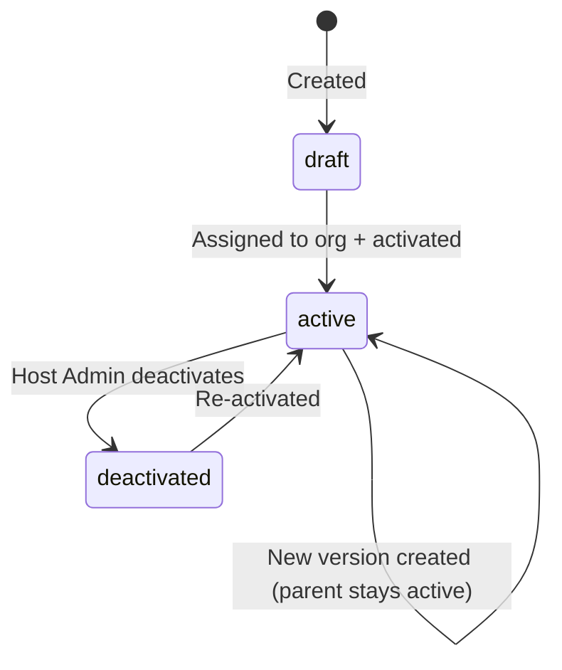

# Flow 4 — Policy Management

**Actors:** Host Admin
**Platform:** Host Portal (`/policies`)
**Precondition:** Organization exists, taxonomy configured

---

## Overview

Benefit policies define what wellness services employees can access, how much they get, and under what conditions. Host Admin creates policies, configures benefit groups and individual service allocations, then assigns policies to organizations. Policies support versioning (create a variant for a subset of employees) and cloning (copy an existing policy as a starting point).

---

## Diagram

```mermaid
flowchart TD
    A([Host Admin]) --> B[/policies]
    B --> C{Create new policy}
    C -->|From template| D[Select PolicyTemplate\npre-fills all settings]
    C -->|From scratch| E[Blank form]
    C -->|Clone existing| F[Clone policy\ncopy all groups + benefits]

    D & E & F --> G[Basic Info\nname, code, description]
    G --> H[Eligibility\nemploymentTypes, age, gender, tier, dept]
    H --> I[Structure\npool type, dependents coverage]
    I --> J[Utilization\nFixed vs Prorated\nrefresh cycle + activation mode]
    J --> K[Spending Caps\ntotalCapAmount, dependentsCapAmount]
    K --> L[Add Benefit Groups\nHealth, Fitness, etc.]

    L --> M[Per Group: add Benefits\nservice + amount + co-payment]
    M --> N{More groups?}
    N -->|Yes| L
    N -->|No| O[Review & Save as Draft]

    O --> P[Policy: status draft]
    P --> Q{Assign to org?}
    Q -->|Yes| R[Select Organization\npolicy.organizationId set]
    Q -->|No| S[Policy stays in draft\nassign later]

    R --> T[Activate policy\nstatus: active]
    T --> U[Employees become eligible\nbased on eligibility filters]

    P --> V{Need a version?}
    V -->|Yes| W[Create Policy Version\nfor specific employees]
    W --> X[parentPolicyId + targetEmployeeIds set]
    X --> T
```

---

## Steps

### Create Policy

1. **[Host Admin] Choose creation method**
   - **Template:** Select from pre-built policy templates (e.g., "Standard Benefits", "Executive Wellness")
   - **Scratch:** Start with blank form
   - **Clone:** Copy an existing policy; all groups and benefits are duplicated

2. **[Host Admin] Basic Info**
   - Name (display in HR portal and member app)
   - Code (short identifier, e.g., `POL-STD-2024`)
   - Description

3. **[Host Admin] Eligibility**
   - `eligibleEmploymentTypes`: which employee types qualify (`full_time`, `part_time`, `contract`, `internship`)
   - Optional filters: `minAge`, `maxAge`, `gender`, `tierIds[]`, `departmentIds[]`
   - `coversDependents: boolean` — whether family members can use this policy

4. **[Host Admin] Structure**
   - `benefitPoolType: "Individual" | "Shared"` — per-employee vs. shared group pool
   - `dependentsPoolType` (only if `coversDependents`): `"Individual" | "Shared" | "SharedWithEmployee"`

5. **[Host Admin] Utilization & Refresh**
   - `utilisationMode: "Fixed" | "Prorated"` — Fixed gives full entitlement from day 1; Prorated calculates based on join date within the cycle
   - `prorateUnit` (if Prorated): `"Daily" | "Weekly" | "Monthly" | "Quarterly"`
   - `refreshCycle`: how often the pool resets (`Daily | Weekly | Monthly | Quarterly | Yearly`)
   - `refreshStartReference`: `"fy_start" | "join_date" | "custom_date"`
   - `activationMode`: when new employees get benefits (`"after_join" | "after_probation" | "custom_date"`)

6. **[Host Admin] Spending Caps** (optional)
   - `totalCapAmount`: max RM the employee can spend per cycle (null = uncapped)
   - `dependentsCapAmount`: max RM for dependents per cycle

7. **[Host Admin] Add Benefit Groups**
   - Group name (e.g., "Health", "Fitness")
   - `distributionType: "SharedAmount" | "IndividualBenefitAmount"`
   - `maxUsagePerCycle` (optional)

8. **[Host Admin] Add Benefits per Group**
   - Select Tier 2 service (`serviceId`)
   - Set `amount` (RM allocation)
   - If `coversDependents`: optionally split into `employeeAmount` and `dependantAmount`
   - Configure co-payment: `required: boolean`, `type: "Percentage" | "Fixed"`, `value`

9. **[Host Admin] Review & Save**
   - Policy saved as `status: draft`

### Assign Policy

10. **[Host Admin] Assign to Organization**
    - Policy linked to `organizationId`
    - Policy `status` → `active`
    - Eligible employees begin accruing benefits based on their `joinDate` and `activationMode`

### Versioning

11. **[Host Admin] Create Policy Version**
    - Clone an active policy, selecting specific `targetEmployeeIds`
    - Version has `parentPolicyId` referencing the original
    - Version can have different amounts or eligibility rules
    - Useful for grandfathering employees or running pilot programs

---

## Policy Status Lifecycle



---

## Business Rules

- A policy can only be assigned to one organization (1:1)
- Multiple policies can be assigned to the same org (employees can be on different policies)
- Policy versions (`parentPolicyId` set) inherit the parent's org but can override eligibility and amounts
- `targetEmployeeIds` in a version explicitly pins which employees use the version vs. the parent
- Deactivating a policy immediately stops benefit accrual; existing claims are not reversed
- Pool refresh is based on `refreshCycle` + `refreshStartReference` relative to the org's `financialYearStart`
- If `utilisationMode = Prorated`, entitlement is recalculated each refresh cycle based on the employee's `joinDate` within the cycle

---

## Co-Payment Routing

| Redemption Type | Co-payment Collection |
|-----------------|----------------------|
| Online purchase (member app) | Employee pays co-payment via Welluber payment gateway; remainder deducted from benefit pool |
| Walk-in claim (SP portal) | SP collects co-payment directly from employee; only benefit portion deducted from pool |

---

## Error States

| Error | Handling |
|-------|---------|
| Policy assigned to org that already has active policy | Warning shown — multiple policies allowed but HR must confirm |
| Benefit amount exceeds group cap | Validation error — benefit amount must fit within group total |
| `prorateUnit` missing when `utilisationMode = Prorated` | Validation error |
| `dependentsPoolType` missing when `coversDependents = true` | Validation error |

---

## Data Written

| Entity | Action |
|--------|--------|
| BenefitPolicy | Created (draft → active) |
| BenefitGroup | Created per group added |
| Benefit | Created per service allocation |
| AuditLogEntry | Written for creation, assignment, activation, deactivation |
