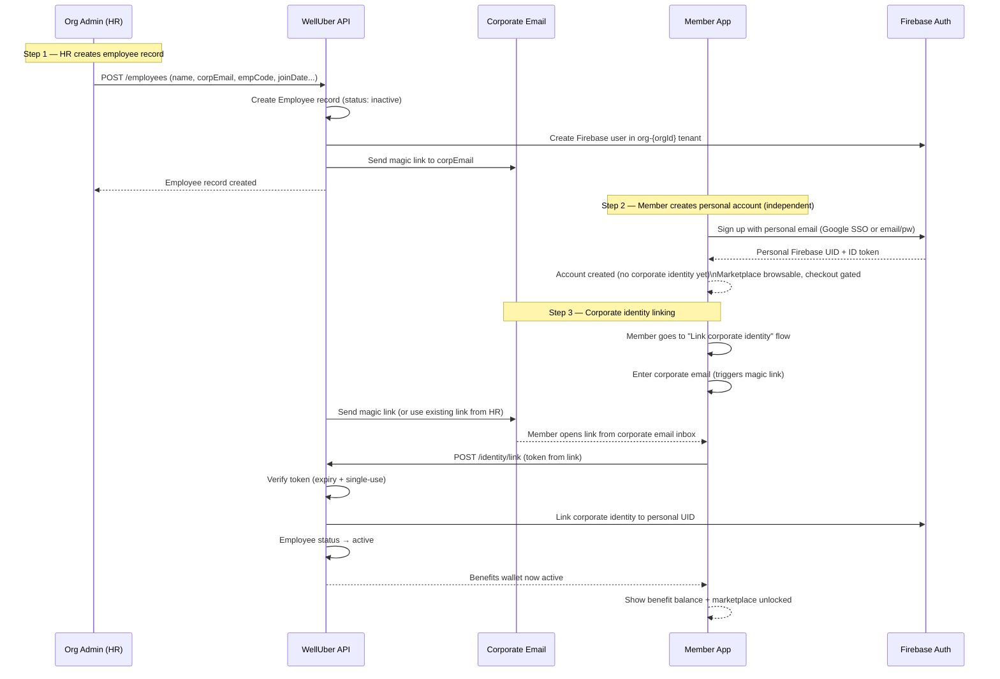

# Flow 5 — Member Activation

**Actors:** Member (Employee), Org Admin
**Platform:** Member App, Org Portal (HR side)
**Precondition:** Employee record exists in org, org has active policy

---

## Overview

A WellUber account is a permanent personal identity. Corporate identities (employment records) are linked to it via a secure two-inbox verification flow. The member creates a personal account using their personal email, then links their corporate identity using a magic link sent to their corporate email. Both inboxes must be involved — preventing impersonation.

---

## Diagram

---

## Steps

### Part A — HR Creates Employee Record

1. **[Org Admin] Add employee**
   - Navigate to Org Portal → Employees → Add Employee
   - Required: name, corporate email, employee code (`empCode`), join date, employment type
   - Optional: department, tier, date of birth (required for age-based eligibility), mobile number

2. **[System] Create employee and send invitation**
   - `Employee` record created with `status: inactive`
   - Firebase user created in `org-{orgId}` tenant with corporate email
   - Magic link sent to corporate email (60-min expiry)

3. **[Org Admin] Alternative: CSV bulk upload**
   - Upload CSV with employee data
   - System validates all rows, reports errors
   - All valid employees created and invited in batch

### Part B — Member Creates Personal Account

4. **[Member] Download Member App**
   - Sign up with personal email (Google SSO, Apple SSO, or email + password)
   - Firebase account created (no tenant — personal identity)

5. **[System] Personal account state**
   - Marketplace is browsable
   - Checkout and wallet features gated until corporate identity linked

### Part C — Corporate Identity Linking

6. **[Member] Initiate identity linking**
   - In app: tap "Link your company benefits"
   - Enter corporate email address

7. **[System] Send / re-use magic link**
   - If HR already sent a link and it's still valid: reuse it
   - Otherwise: generate new magic link, send to corporate email

8. **[Member] Open magic link from corporate email**
   - Must open the link from a device with the Member App installed
   - Universal link: `welluber://verify-identity/[token]`
   - Browser shows redirect message — verification cannot happen in browser

9. **[System] Validate and link**
   - Check token: not expired (< 60 min), not yet used
   - Link corporate Firebase identity to personal UID
   - `Employee.status` → `active`
   - Invalidate token (single-use)

10. **[Member] Benefits activated**
    - Wallet becomes visible with allocated benefit amounts
    - Marketplace is fully unlocked (checkout enabled)
    - Onboarding screen shows benefit summary

---

## Two-Inbox Security

The two-inbox model prevents impersonation:

| Check | Purpose |
|-------|---------|
| Magic link sent to **corporate email** | Proves the person controls the corporate address |
| Personal account created with **personal email** | Proves the person controls a permanent identity |
| Both must be involved | Prevents a bad actor from linking someone else's corporate benefits |

An employee who leaves the company has their corporate identity deactivated (by HR) but retains their personal WellUber account and access history.

---

## Business Rules

- One personal Welluber account can hold multiple corporate identities (employee at multiple companies)
- Deactivation removes benefit access immediately — history is preserved
- Magic link: 60-min expiry, single-use, invalidated on first successful use
- If token expired: member must request a new link; HR can resend from Org Portal
- Checkout is gated until at least one active corporate identity exists
- Pre-link state: marketplace is browsable, wallet not shown

---

## Error States

| Error | Handling |
|-------|---------|
| Magic link expired | Member requests resend; HR receives notification |
| Corporate email already linked to another personal account | Block linking; surface error — contact support |
| Employee not found (empCode/email mismatch) | Validation error — contact HR |
| Token already used | Show "already activated" message |

---

## Data Written

| Entity | Action |
|--------|--------|
| Employee | Created (status: `inactive`) on HR upload; updated to `active` on link |
| Member | Firebase user created with personal email |
| CorporateIdentity | Created and linked to Member UID on magic link verification |
| AuditLogEntry | Written for employee creation, magic link sent, identity linked |
