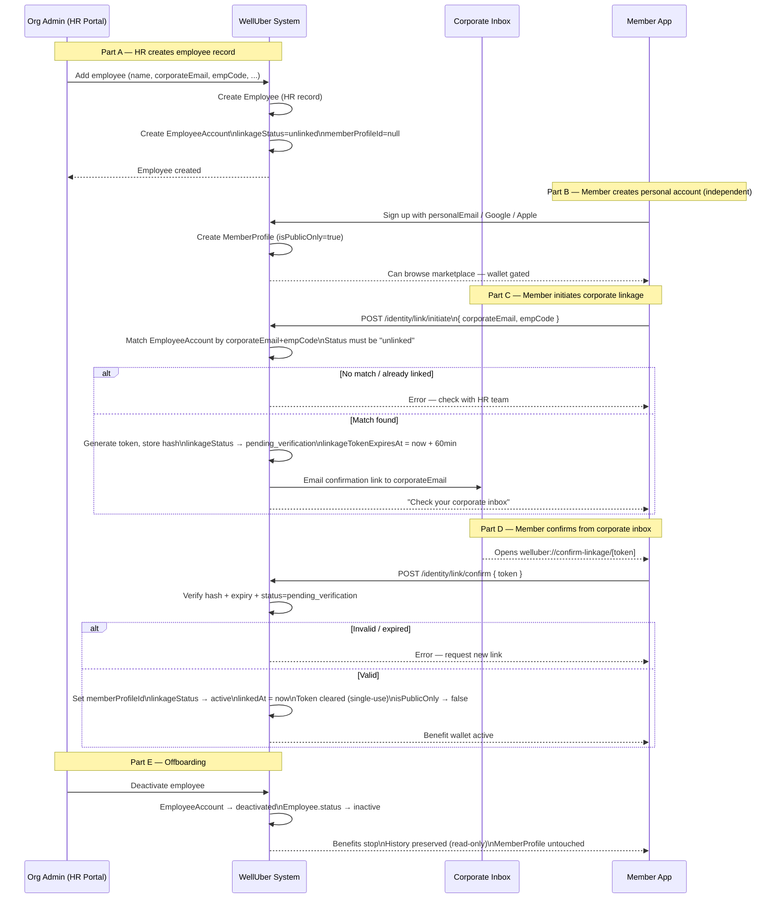

# Flow 5 — Member Activation & Corporate Identity Linking

**Actors:** Member (public user), HR / Org Admin, System
**Platforms:** Member App (sign-up + linkage), Org Portal (HR creates employee record)
**Precondition:** Employee record exists in the org (created by HR)

---

## Overview

WellUber has two distinct identity layers:

| Layer | Entity | Purpose |
|-------|--------|---------|
| **Personal identity** | `MemberProfile` | Permanent. Created on first app sign-up. Survives company changes. |
| **Corporate identity** | `EmployeeAccount` | Per-employer. Bridges HR's `Employee` record with a `MemberProfile`. Deactivated when employment ends; history preserved. |

A `MemberProfile` can be **public-only** (no linked employer — can browse, cannot use benefit wallet) or **linked** (one or more active `EmployeeAccount` connections — wallet unlocked per employer).

**Security model — two-step verification:**
1. Member enters `corporateEmail` + `empCode` → system sends confirmation to the corporate inbox
2. Member clicks confirmation link from the corporate inbox → linkage confirmed

Knowing the credentials alone is not enough — inbox access is the second factor.

---

## Diagram

---

## Steps

### Part A — HR Creates Employee Record

1. HR adds employee in Org Portal: `name`, `corporateEmail`, `empCode`, `joinDate`, `employmentType`
2. System creates `Employee` (HR record) and `EmployeeAccount` (`linkageStatus: "unlinked"`)
3. HR communicates `corporateEmail` + `empCode` to the employee through onboarding

### Part B — Member Creates Personal Account

4. Member downloads app, signs up with personal email / Google / Apple
5. `MemberProfile` created: `isPublicOnly: true` — marketplace browsable, wallet gated

### Part C — Initiate Corporate Linkage

6. Member taps "Link Company Benefits" — enters `corporateEmail` + `empCode`
7. System matches `EmployeeAccount` — rejects if not found, already linked, or deactivated
8. System generates token (stores only the hash), emails confirmation link to `corporateEmail`
9. `EmployeeAccount.linkageStatus` → `"pending_verification"`, 60-min expiry set

### Part D — Confirm from Corporate Inbox

10. Member opens confirmation link from corporate inbox: `welluber://confirm-linkage/[token]`
11. System verifies: hash matches + not expired + status = `"pending_verification"`
12. On success: `memberProfileId` set, `linkageStatus → "active"`, `linkedAt` = now, token cleared
13. `MemberProfile.isPublicOnly` → `false` — benefit wallet now active

### Part E — Offboarding

14. HR deactivates: `EmployeeAccount.linkageStatus → "deactivated"`, `Employee.status → "inactive"`
15. Benefits stop immediately; `MemberProfile` remains — history visible as read-only
16. Member can link a new employer later (Part C again with new company credentials)

---

## Multiple Employers

One `MemberProfile` can have multiple active `EmployeeAccounts`:
- Each employer creates their own `EmployeeAccount` (separate HR record)
- Member links each through Part C + D separately
- Each company's wallet and benefit pools are fully isolated
- Claims reference the specific `EmployeeAccount` + `Account` (wallet) of that employer

---

## Token Security

| Property | Value |
|----------|-------|
| Storage | SHA-256 hash only — plaintext never stored |
| Expiry | 60 minutes |
| Reuse | Single-use — cleared on confirmation |
| Delivery | Sent to `corporateEmail` only (never `personalEmail`) |
| Brute force | Rate-limited per IP + per `employeeId` |

---

## Business Rules

- Both `corporateEmail` AND `empCode` must match — neither alone is sufficient
- Confirmation requires corporate inbox access — the second factor
- One `EmployeeAccount` links to one `MemberProfile` only
- Deactivation is immediate — no grace period in v1
- Dependent personal profiles (`DependentAccount`) follow a simplified version if the company enables dependent app access; otherwise dependents are managed through the employee's session

---

## Error States

| Error | Handling |
|-------|---------|
| `corporateEmail` + `empCode` not found | "Credentials not recognised — check with your HR team." Do not reveal which field is wrong. |
| Already linked to another profile | "This account is already connected. Contact your HR admin." |
| EmployeeAccount deactivated | "This employment record is no longer active." |
| Token expired | "Confirmation link expired — request a new one." |
| Token already used | "This link has already been used." |

---

## Data Written

| Entity | Action |
|--------|--------|
| `Employee` | Created by HR |
| `EmployeeAccount` | Created (`unlinked`) → `pending_verification` → `active` → `deactivated` |
| `MemberProfile` | Created on sign-up; `isPublicOnly` updated on confirmation |
| `DependentAccount` | Created if dependent has own app access (optional) |
| `AuditLogEntry` | Written at each status transition |
