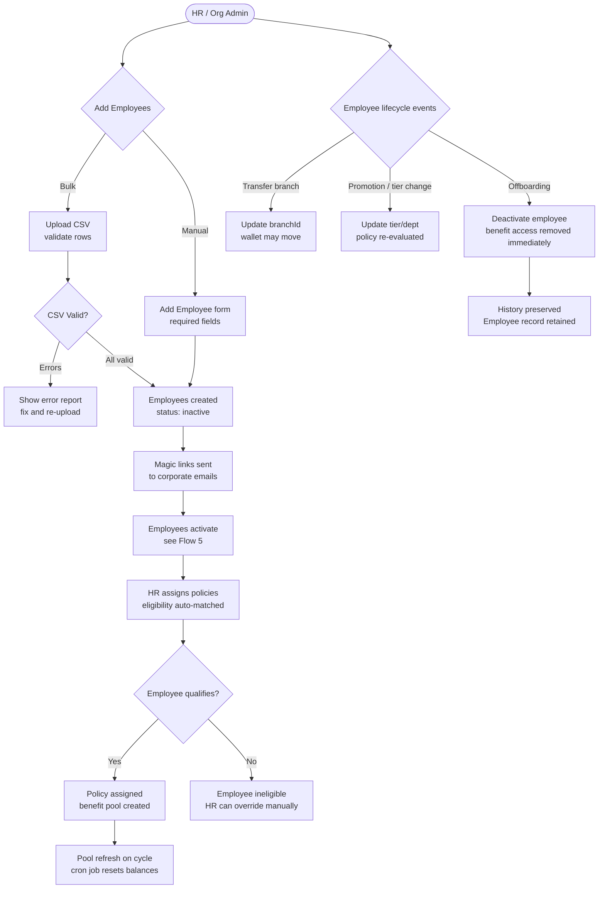

# Flow 6 — Employee Management

**Actors:** Org Admin / HR
**Platform:** Org Portal
**Precondition:** Organization is active, at least one policy exists

---

## Overview

HR manages the employee directory, controls benefit eligibility, and handles lifecycle events (onboarding, transfers, offboarding). Employees are added via CSV bulk upload or manual entry. Policy assignment is eligibility-driven — the system matches employees to policies based on their attributes (employment type, department, tier, age, etc.).

---

## Diagram

---

## Steps

### Onboarding

1. **[HR] Upload employees via CSV**
   - Required columns: `name, email, empCode, joinDate, employmentType`
   - Optional: `department, tier, dateOfBirth, gender, mobileNumber, probationEndDate`
   - System validates each row
   - Error report shows row-level issues (duplicate empCode, invalid date, etc.)
   - Valid rows are processed; invalid rows must be corrected and re-uploaded

2. **[HR] Manual employee addition**
   - Form with same fields as CSV
   - `empCode` must be unique within the org

3. **[System] Create employee records**
   - `status: inactive` until magic link is verified (Flow 5)
   - Magic links sent to all corporate emails

### Policy Assignment

4. **[HR] Assign policy to employee**
   - Navigate to employee profile → Policies tab
   - System shows which active org policies the employee qualifies for
   - Eligibility check: employment type, age, gender, tier, department
   - HR confirms assignment

5. **[System] Create benefit pool**
   - Employee's wallet allocated based on policy benefit groups and amounts
   - Prorated if `utilisationMode = Prorated` and employee mid-cycle

6. **[System] Pool refresh (cron)**
   - On refresh cycle date: reset employee's pool balances
   - Prorated employees get recalculated amounts
   - Unused balance does not carry over (unless policy specifies rollover — v2 feature)

### Lifecycle Events

7. **[HR] Branch transfer**
   - Update `Employee.branchId`
   - Associated account wallet may need to be updated

8. **[HR] Tier / Department change**
   - Update `tierId` / `departmentId`
   - System re-evaluates policy eligibility
   - If no longer eligible: warn HR, HR confirms removal or override

9. **[HR] Offboarding**
   - Set `Employee.status: inactive`
   - All active benefit pools deactivated immediately
   - In-flight pre-auth transactions: resolved per policy (default: cancel)
   - History (claims, transactions) retained on employee record

---

## Business Rules

- `empCode` must be unique per organization — used for walk-in member lookup
- Employees with `status: inactive` have no access to benefits or marketplace
- Policy eligibility is evaluated at assignment time and re-evaluated on attribute changes
- HR can manually override eligibility decisions (requires audit log entry)
- Pool balances do not carry over across refresh cycles (v1 — no rollover)
- Probation employees can access benefits only if `activationMode ≠ after_probation` or probation has ended
- Deactivation is immediate — no grace period in v1

---

## Utilization Dashboard

HR can view utilization rates per employee and policy group:
- `utilizationRate` per employee (% of allocation used)
- Ring charts per benefit group
- Employees with 0% utilization flagged for re-engagement
- Employees near 100% flagged for potential top-up

---

## Error States

| Error | Handling |
|-------|---------|
| Duplicate `empCode` in CSV | Row-level error — reject that row |
| Employee already in another org | Warning — corporate identity conflict (support to resolve) |
| Employee ineligible for all policies | Shown on employee profile — HR manually reviews |
| Offboarding employee with active pre-auth | Warning with options: cancel or let settle |

---

## Data Written

| Entity | Action |
|--------|--------|
| Employee | Created on upload/add; updated on lifecycle events |
| BenefitPolicy | Policy-employee assignment recorded |
| AccountTransaction | Deduction on benefit use, pre-auth on purchase |
| AuditLogEntry | Written for all HR actions (upload, assign, deactivate) |
