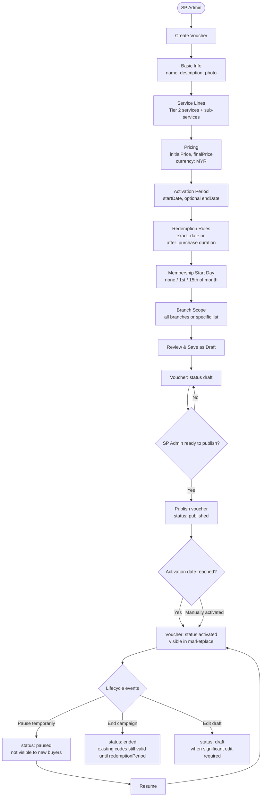
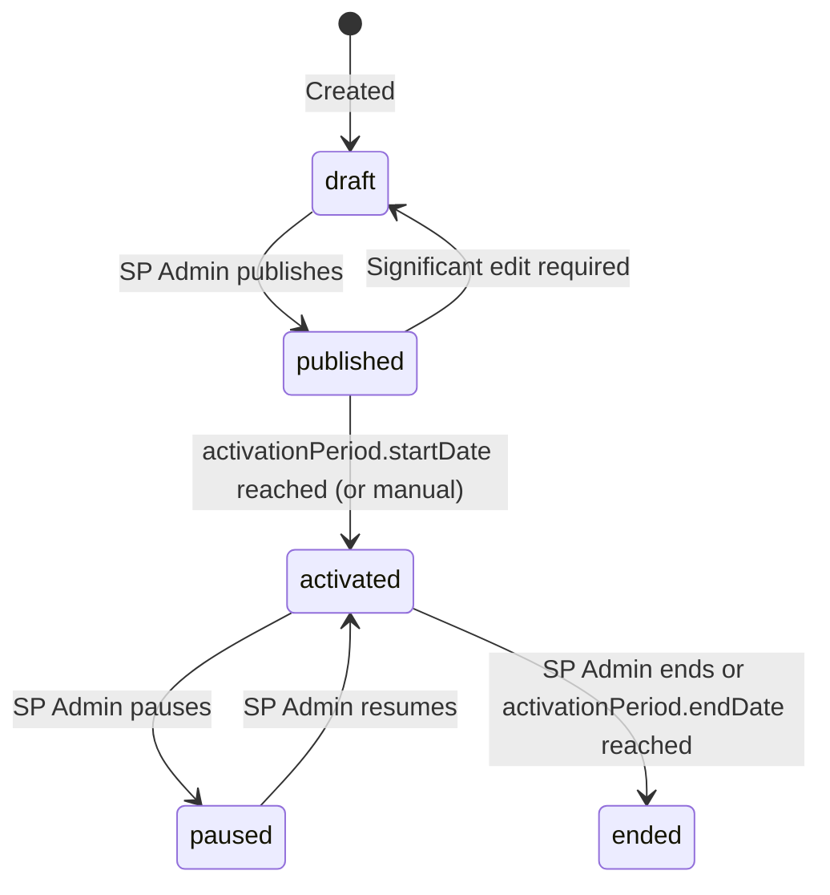

# Flow 7 — SP Voucher Creation & Lifecycle

**Actors:** SP Admin
**Platform:** SP Portal
**Precondition:** SP is active, at least one branch configured

---

## Overview

Service providers package their offerings into "vouchers" — purchasable benefit units that members buy through the marketplace. A voucher defines which services are covered, their pricing, validity window, redemption rules, and which branches accept it. Vouchers go through a lifecycle from draft to activation, with the ability to pause or end them.

---

## Diagram



---

## Steps

1. **[SP Admin] Basic Info**
   - Name (shown in marketplace)
   - Description (full details)
   - Summary (short tagline for cards)
   - Photo URL
   - `bookingRequired: boolean` (if true, member must book appointment before using)

2. **[SP Admin] Define Service Lines**
   - Add one or more service lines (`ServiceLine[]`)
   - Per line: select Tier 2 service, select sub-services, add description
   - Sub-services are informational (e.g., "Daily Pass", "Monthly Membership")
   - Commission is calculated using the Tier 1 category derived from each service line

3. **[SP Admin] Pricing**
   - `initialPrice`: base price before discounts (RM)
   - `finalPrice`: gross selling price inclusive of SST (if SP is tax-registered)
   - `currency: "MYR"` (only supported in v1)

4. **[SP Admin] Activation Period**
   - `activationPeriod.startDate`: when voucher becomes purchasable
   - `activationPeriod.endDate` (optional): when it stops being sold (codes already issued remain valid)

5. **[SP Admin] Validation Duration** (optional)
   - How long the voucher is valid after being issued (not after purchase)
   - Unit: `days | months | half_year | year`, value: number

6. **[SP Admin] Redemption Period**
   - `mode: "exact_date"` — voucher redeemable on a specific date only
   - `mode: "after_purchase"` — redeemable within N hours/days/months after purchase

7. **[SP Admin] Membership Start Day**
   - `"none"` — starts immediately
   - `"1st"` — membership period starts on the 1st of the following month
   - `"15th"` — membership period starts on the 15th of the current or next month

8. **[SP Admin] Branch Scope**
   - `"all"` — valid at all SP branches
   - `"specific"` — select specific `branchIds`

9. **[SP Admin] Review and Save**
   - Voucher saved as `status: draft`
   - Code auto-generated: `PAC{SPID}NNNN`

### Publication

10. **[SP Admin] Publish voucher**
    - Review all settings
    - `status` → `published`
    - Visible to Host Admin and Org Admin for review

11. **[System / SP Admin] Activation**
    - On `activationPeriod.startDate`: `status` → `activated`
    - Voucher appears in member marketplace

---

## Voucher Status Lifecycle



---

## Weighted Commission on Multi-Service Vouchers

When a voucher covers multiple service lines, commission is distributed proportionally:

```
Weight_i = price_contribution_i / finalPrice
Commission = SUM(finalPrice × Weight_i × commissionRate(category_i))
```

The commission rate used is looked up at transaction time from the SP's `CommissionSchemaRow` for the relevant `mainService`.

---

## Business Rules

- Voucher codes are auto-generated and immutable once created
- `finalPrice` must include SST if SP is tax-registered (system validates against `taxRate`)
- Paused vouchers: existing purchasers can still redeem; new purchases are blocked
- Ended vouchers: no new purchases; existing codes valid until their `redemptionPeriod` expires
- Branch scope `"specific"` requires at least one `branchId`
- `bookingRequired = true` means the SP's system must be contacted before presenting the TOTP code
- Significant edits to an activated voucher require setting back to `draft` (immutability for issued codes)

---

## Error States

| Error | Handling |
|-------|---------|
| No service lines added | Validation error — at least one required |
| `finalPrice` < `initialPrice` without discount justification | Warning |
| Activation date in the past | Validation error |
| Branch scope `specific` with empty `branchIds` | Validation error |
| Voucher already has issued codes when trying to end | Warning — show count of active codes |

---

## Data Written

| Entity | Action |
|--------|--------|
| SpVoucher | Created (draft → published → activated) |
| ServiceLine | Created per service line added |
| AuditLogEntry | Written for create, publish, status changes |
