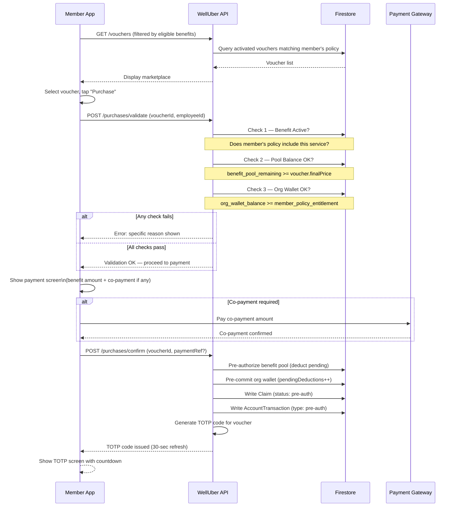

# Flow 8 — Online Voucher Purchase

**Actors:** Member
**Platform:** Member App
**Precondition:** Member has active corporate identity, org wallet is funded, voucher is activated

---

## Overview

The member browses the marketplace, selects a voucher, and completes a purchase. Three validation gates must all pass before payment is accepted. On successful purchase, a TOTP code is issued for redemption at the SP. The member's benefit pool is pre-authorized (deducted) and the org wallet pre-committed.

---

## Diagram

---

## Steps

1. **[Member] Browse marketplace**
   - Vouchers filtered by: activated status, member's eligible policy services, branch availability
   - Vouchers display: name, price, services covered, booking required flag

2. **[Member] Select voucher and tap Purchase**
   - View voucher details
   - Confirm purchase intent

### Three-Point Validation

3. **[System] Check 1 — Benefit Active**
   - Verify member's policy has an active `Benefit` for the voucher's service category
   - Check `activationMode` — has probation ended? Has join date condition passed?
   - Fail → "Your benefits don't cover this service"

4. **[System] Check 2 — Pool Balance**
   - `benefit_pool_remaining >= voucher.finalPrice`
   - Remaining = allocated amount − used − pending pre-auths
   - Fail → "Insufficient benefit balance — RM X remaining, voucher costs RM Y"

5. **[System] Check 3 — Org Wallet**
   - `org_wallet_balance >= member_policy_entitlement`
   - This prevents overspending beyond the org's funded amount
   - Fail → "Service temporarily unavailable" (HR needs to top up)

### Payment

6. **[Member] Co-payment (if required)**
   - If policy has co-payment: show split (benefit portion + co-payment portion)
   - Member pays co-payment via Welluber payment gateway (FPX / credit card)
   - Payment gateway confirms

7. **[Member] Confirm purchase**
   - Final confirmation screen

### TOTP Issuance

8. **[System] Pre-authorize and issue code**
   - Write pre-auth to benefit pool and org wallet (not yet settled)
   - Create `Claim` with `status: pre-auth`
   - Create `AccountTransaction` with `type: pre-auth`
   - Generate TOTP code (RFC 6238, 30-second refresh)

9. **[Member] Use TOTP code**
   - Member presents TOTP code at SP (in person or shows phone screen)
   - TOTP refreshes every 30 seconds
   - Valid for the entire `redemptionPeriod` of the voucher

---

## Business Rules

- All three validation checks must pass simultaneously — partial passes do not allow purchase
- Check 3 is the wallet blocking rule: protects org from overspending even if pools look healthy
- Co-payment routing: online purchases → Welluber gateway (not SP directly)
- Pre-auth is recorded immediately; actual settlement happens in Flow 12
- TOTP is session-scoped to the purchase — not reusable after redemption
- Member cannot purchase the same voucher twice if the first is still `pre-auth` status

---

## Error States

| Error | Handling |
|-------|---------|
| Check 1 fails | "This service is not in your benefit plan" |
| Check 2 fails | "Insufficient benefit balance — top up needed" (HR notified) |
| Check 3 fails | "Service temporarily unavailable — contact HR" |
| Payment gateway fails | Retry option shown; no pre-auth written until payment confirmed |
| Member concurrent purchase attempt | Lock on member's pending purchases — one at a time |

---

## Data Written

| Entity | Action |
|--------|--------|
| Claim | Created with `status: pre-auth` |
| AccountTransaction | Created with `type: pre-auth` |
| GeneratedVoucher | TOTP code stored |
| Account | `pendingDeductions` incremented |
| AuditLogEntry | Written for purchase attempt and confirmation |
