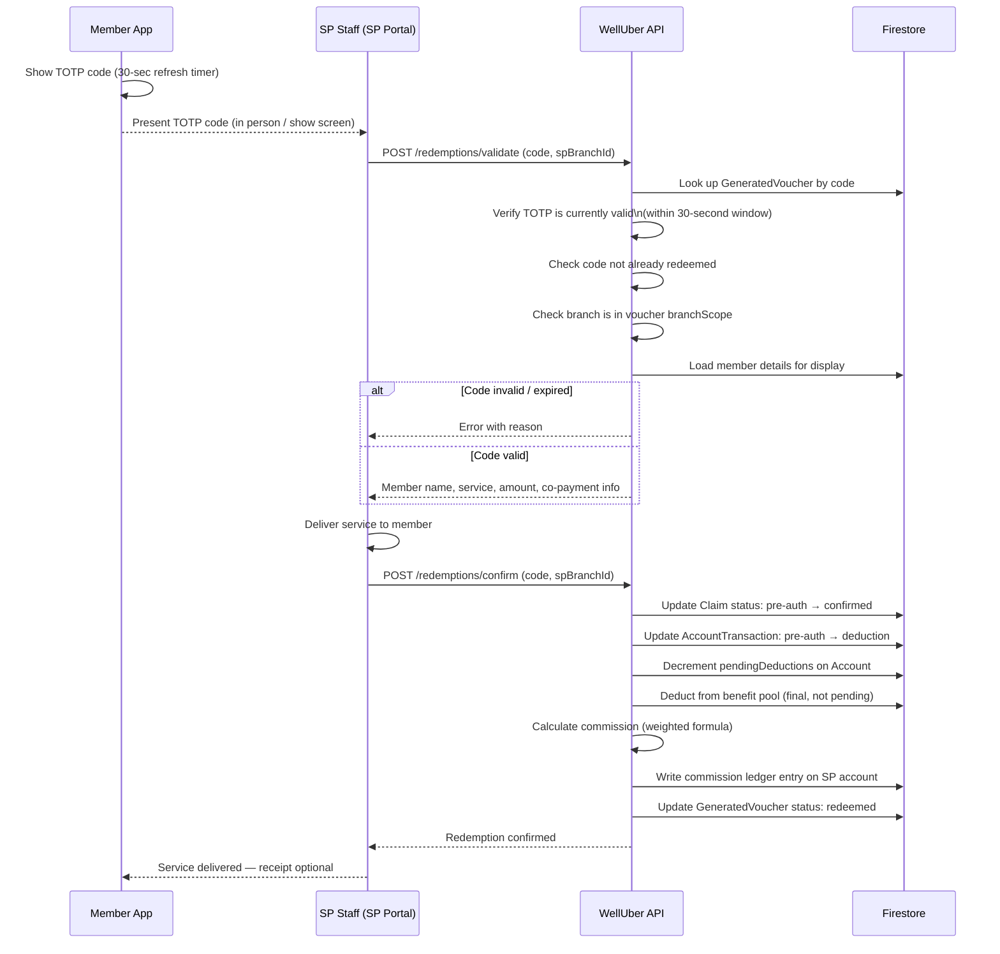

# Flow 9 — Voucher Redemption

**Actors:** Member, SP Staff
**Platform:** Member App (TOTP), SP Portal (code entry)
**Precondition:** Member has a `pre-auth` claim with an active TOTP code

---

## Overview

The member presents their TOTP code at the SP. SP staff enters the code into the SP Portal, which validates it and confirms the redemption. This transitions the claim from `pre-auth` to `confirmed`, triggers commission calculation, and settles the deduction on the org wallet.

---

## Diagram

---

## Steps

### At the SP

1. **[Member] Show TOTP code**
   - Member opens Member App → active vouchers
   - TOTP code displayed with 30-second countdown
   - Code refreshes automatically

2. **[SP Staff] Enter code in SP Portal**
   - Navigate to SP Portal → Redemptions → Enter Code
   - Enter the 6-digit TOTP code and select branch (if multi-branch SP)

3. **[System] Validate code**
   - Look up `GeneratedVoucher` by code
   - Verify TOTP is within the current 30-second window
   - Check `status` is not `redeemed`, `expired`, or `cancelled`
   - Check branch is in `voucher.branchIds` (or scope is `"all"`)

4. **[SP Staff] Review member details**
   - System shows: member name, service(s), benefit amount, co-payment info
   - SP staff confirms service will be delivered

5. **[SP Staff] Deliver service**
   - Provide the wellness service to the member

6. **[SP Staff] Confirm redemption**
   - Tap "Confirm Redemption" in SP Portal

### Post-Redemption

7. **[System] Settle claim**
   - `Claim.status`: `pre-auth` → `confirmed`
   - `AccountTransaction.type`: `pre-auth` → `deduction`
   - `Account.pendingDeductions` decremented
   - Benefit pool deducted (final)
   - `GeneratedVoucher.status`: `redeemed`, `redeemedAt` timestamped

8. **[System] Calculate and record commission**
   - Commission formula: `SUM(finalPrice × weight_i × rate_i)`
   - Rate at time of redemption (from SP's `CommissionSchemaRow`)
   - Commission recorded on SP's settlement ledger
   - Rates stored immutably on the commission record

---

## Co-Payment on Walk-in (Cross-reference)

For **online purchases** (this flow): co-payment was already collected by Welluber gateway at purchase time (Flow 8). SP staff does not need to collect anything additional.

For **walk-in claims** (Flow 10): co-payment is collected by SP directly from the member. Only the benefit portion is deducted from the wallet.

---

## Business Rules

- TOTP window: 30-second standard (RFC 6238) — one window tolerance allowed for clock drift
- Code can only be confirmed once — `redeemed` status prevents replay
- Branch check is enforced at validation time — code cannot be redeemed at an out-of-scope branch
- Commission is calculated and locked at confirmation time — not at purchase time
- If SP confirms but delivery fails: SP initiates a refund (creates `reversal` transaction)
- `VoucherRedemption` record is created for every confirmed redemption (settlement input)

---

## Error States

| Error | Handling |
|-------|---------|
| Code not found | "Code not recognized — check and re-enter" |
| TOTP window expired | "Code expired — ask member to show current code" |
| Already redeemed | "This code has already been used" |
| Branch not in scope | "This voucher is not valid at this branch" |
| Member pre-auth cancelled | "Voucher is no longer active" |

---

## Data Written

| Entity | Action |
|--------|--------|
| Claim | `status` → `confirmed` |
| AccountTransaction | `type` → `deduction` (finalized) |
| Account | `pendingDeductions` decremented, `balance` deducted |
| GeneratedVoucher | `status` → `redeemed`, `redeemedAt` set |
| VoucherRedemption | Created (input for settlement) |
| CommissionLedger | Commission entry written on SP account |
| AuditLogEntry | Written for confirmation |
