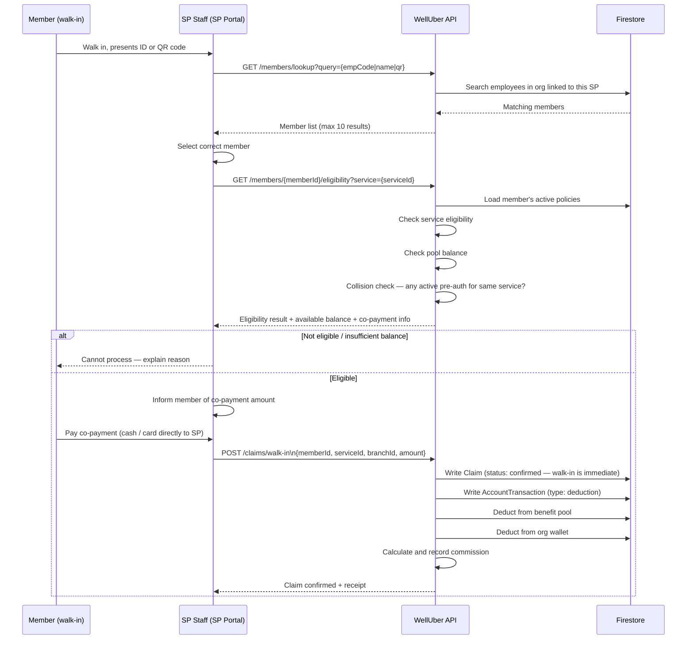

# Flow 10 — Walk-In Claim

**Actors:** SP Staff, Member
**Platform:** SP Portal (staff), Member App (optional, for QR)
**Precondition:** SP is active, member has active corporate identity with eligible benefits

---

## Overview

Walk-in claims skip the online purchase step — the member visits an SP directly and the SP staff processes the claim in real time. SP staff looks up the member (by QR code, employee code, or name), checks eligibility, confirms the service, and deducts from the benefit pool. Co-payment is collected by the SP directly.

---

## Diagram

---

## Steps

### Member Lookup

1. **[SP Staff] Identify member**
   - Option A: Scan member's QR code from Member App
   - Option B: Enter employee code (`empCode`) manually
   - Option C: Search by member name (fuzzy search, returns up to 10)

2. **[System] Return member details**
   - Name, org, branch, photo (if available)
   - SP staff visually confirms identity

### Eligibility Check

3. **[SP Staff] Select service**
   - Choose from the SP's active services

4. **[System] Check eligibility**
   - Member has active policy with this service in their benefit groups
   - Pool balance >= service amount
   - No active pre-auth for the same service (collision check)

5. **[System] Collision check**
   - If member has an open `pre-auth` claim for the same service at a different SP: warn SP staff
   - Prevents double-dipping: member cannot use wallet for same service twice simultaneously

### Co-Payment

6. **[SP Staff] Inform member of co-payment**
   - Show benefit amount (from wallet) + co-payment (member pays SP directly)
   - Member pays co-payment to SP (cash or card — SP's own terminal)

### Claim Submission

7. **[SP Staff] Submit walk-in claim**
   - Confirm: member, service, amount, branch
   - Optionally: add notes or reference

8. **[System] Process claim (immediate)**
   - Walk-in claims are **immediately confirmed** — no `pre-auth` state
   - `Claim` written with `status: confirmed`
   - `AccountTransaction` written with `type: deduction`
   - Benefit pool and org wallet deducted immediately
   - Commission calculated and recorded

9. **[SP Staff] Issue receipt**
   - Digital receipt shown in SP Portal
   - Member receives notification in Member App

---

## Walk-In vs. Online Purchase

| Aspect | Online Purchase (Flow 8) | Walk-In Claim (Flow 10) |
|--------|--------------------------|-------------------------|
| Purchase flow | Member initiates in app | SP staff initiates in portal |
| Co-payment collection | Welluber gateway | SP collects directly |
| Claim state | `pre-auth` → `confirmed` | `confirmed` immediately |
| TOTP code | Required | Not applicable |
| Wallet deduction | Pre-auth first, settles on redemption | Immediate deduction |

---

## Business Rules

- Walk-in claims must be initiated by SP staff — member cannot initiate walk-in from app
- Co-payment is SP's responsibility to collect — Welluber does not process it
- Collision check: if a `pre-auth` claim for the same service exists (from Flow 8), SP staff must resolve before proceeding
- Claim amount cannot exceed the member's remaining benefit pool for that service
- Walk-in claims are final on confirmation — no `pre-auth` buffer
- SP can cancel a walk-in claim within a grace period (configurable; default: 24 hours)

---

## Error States

| Error | Handling |
|-------|---------|
| Member not found | "No member found — verify employee code or ask member for ID" |
| Service not in member's policy | Show which services the member can use at this SP |
| Insufficient pool balance | Show remaining balance — member decides to proceed with partial or decline |
| Collision detected | Show existing pre-auth — staff can override with justification (audit logged) |
| Org wallet insufficient | Block claim — HR must top up before walk-in can proceed |

---

## Data Written

| Entity | Action |
|--------|--------|
| Claim | Created directly with `status: confirmed` |
| AccountTransaction | Created with `type: deduction` (immediate) |
| Account | Balance deducted immediately |
| VoucherRedemption | Created for settlement records |
| CommissionLedger | Commission entry written |
| AuditLogEntry | Written for claim creation (includes SP staff identity) |
