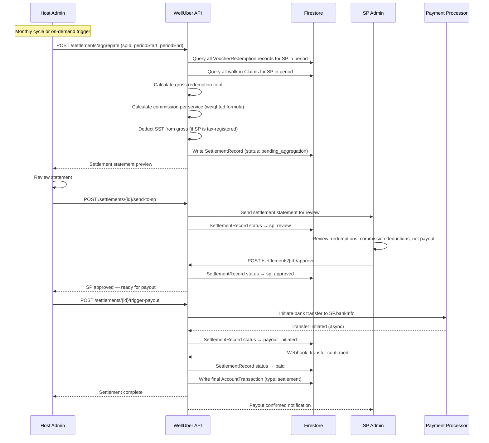
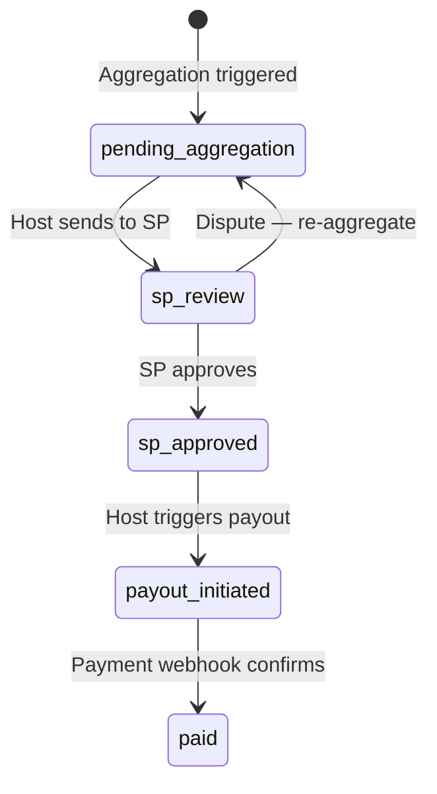

# Flow 12 — Settlement & Payout

**Actors:** Host Admin, SP Admin
**Platform:** Host Portal (`/accounts`, `/transactions`), SP Portal
**Precondition:** Confirmed claims exist for the settlement period

---

## Overview

Settlement is the process of aggregating all confirmed redemptions for an SP in a period, calculating the net payout (after commission), and transferring funds to the SP's bank account. The SP must approve the settlement statement before Host Admin triggers the payout. All records are immutable for 7-year tax retention.

---

## Diagram



---

## Steps

### Aggregation

1. **[Host Admin] Trigger aggregation**
   - Auto-trigger: monthly cron (default) or scheduled
   - Manual trigger: Host Admin navigates to `/accounts`, selects SP, triggers settlement

2. **[System] Aggregate redemptions**
   - Collect all `VoucherRedemption` records for the SP in the settlement period
   - Collect all walk-in `Claim` records (type: `redemption`) for the SP
   - Group by service category for commission calculation

3. **[System] Calculate settlement amounts**
   ```
   For each redemption:
     gross_amount = voucher.finalPrice (or walk-in claim.amount)
     sst_amount   = gross × taxRate (if SP isTaxRegistered)
     net_pre_commission = gross - sst_amount
     commission   = SUM(net_pre_commission × weight_i × rate_i)
     sp_payout_contribution = net_pre_commission - commission
   
   Total SP Payout = SUM(sp_payout_contribution for all redemptions)
   ```

4. **[System] Write SettlementRecord**
   - `status: pending_aggregation`
   - Includes: period, SP details, gross total, SST, commission breakdown, net payout
   - All rates stored at this moment (immutable for audit)

### SP Review

5. **[Host Admin] Send to SP**
   - Host Admin reviews the aggregation, sends to SP
   - `SettlementRecord.status` → `sp_review`
   - SP Admin receives notification

6. **[SP Admin] Review settlement statement**
   - View: individual redemptions, commission per service, SST deduction, net payout
   - Can flag discrepancies (contact Host Admin)

7. **[SP Admin] Approve settlement**
   - SP taps "Approve Settlement"
   - `SettlementRecord.status` → `sp_approved`
   - Host Admin notified

### Payout

8. **[Host Admin] Trigger payout**
   - Review SP bank details (name, account number, bank)
   - Confirm payout amount
   - `POST /settlements/{id}/trigger-payout`

9. **[System] Initiate bank transfer**
   - Send request to payment processor (FPX / external bank transfer)
   - `SettlementRecord.status` → `payout_initiated`

10. **[Payment Processor] Confirm transfer (webhook)**
    - Async confirmation via webhook
    - `SettlementRecord.status` → `paid`
    - `AccountTransaction` written (type: `settlement`) on both sides
    - Both Host Admin and SP Admin notified

---

## Settlement Status Lifecycle



---

## Commission Deduction Detail

```
Gross Redemption Value
  − SST (if SP is tax-registered)
  = Net Redemption Value
  − Commission (per service, tiered rate)
  = SP Payout
```

Commission rate tiers (from `CommissionSchemaRow`) are evaluated at redemption count at the time of each transaction. The rate used is stored immutably on the commission ledger entry — not re-evaluated at settlement time.

---

## Expired Voucher Settlement

When vouchers expire without being redeemed, a split applies:
- `SP %` of the expired value goes to the SP
- Remaining `%` is retained by Welluber (platform fee)
- Split % configured globally in platform settings (Flow 0)
- Expired voucher settlements are included in the same settlement period

---

## Business Rules

- Settlement is immutable once `status: paid` — no corrections, only reversals
- SP must approve before Host Admin can trigger payout
- Host Admin can trigger payout for any SP at any time (on-demand) or wait for scheduled cycle
- SST is de-calculated from gross at the time of each redemption — stored immutably
- 7-year retention: all settlement records, commission records, tax documents
- Disputed settlement: SP flags discrepancy → Host re-aggregates → new SettlementRecord replaces old
- Bank details verified against SP profile at payout time (not at aggregation time)

---

## Error States

| Error | Handling |
|-------|---------|
| No redemptions in period | Settlement generates zero-payout statement; still logged |
| SP bank details missing | Block payout trigger; Host notified to update SP profile |
| Payment processor error | `status` stays `payout_initiated`; retry mechanism; alert Host Admin |
| SP disputes amount | Host re-aggregates with corrected data; new statement sent |
| Webhook timeout | Manual confirmation available in Host Portal |

---

## Data Written

| Entity | Action |
|--------|--------|
| SettlementRecord | Created on aggregation; status updated through lifecycle |
| AccountTransaction | Written on final `paid` state (type: `settlement`) |
| AuditLogEntry | Written at every status transition |
| CommissionLedger | Commission entries finalized in settlement |
