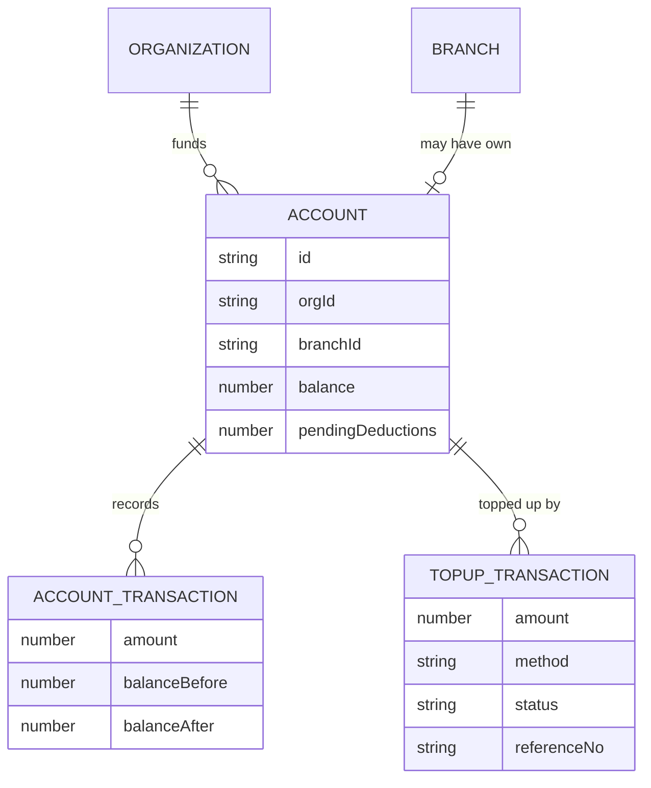
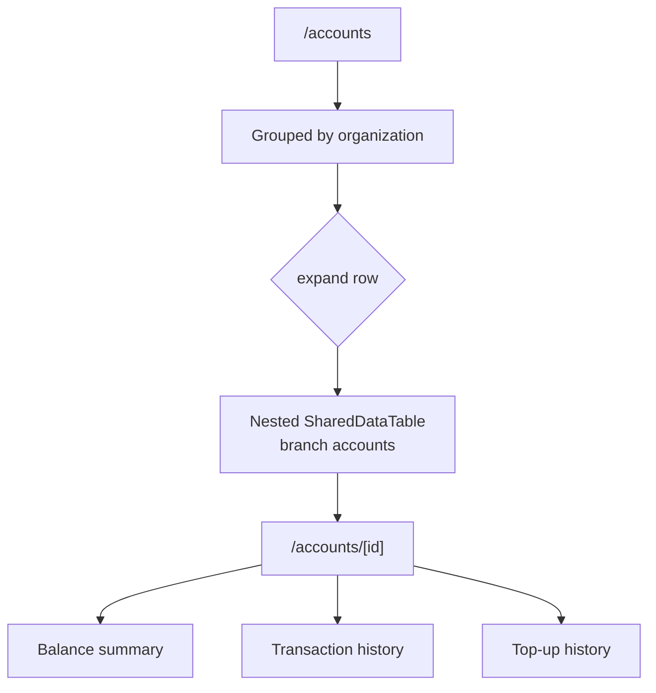
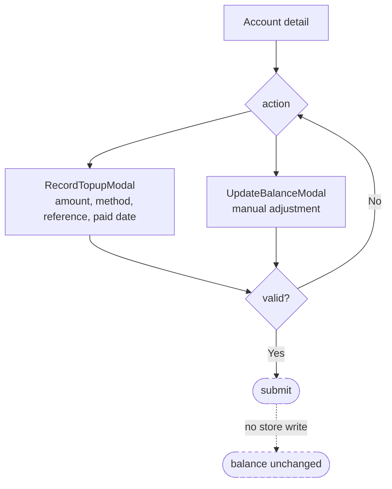
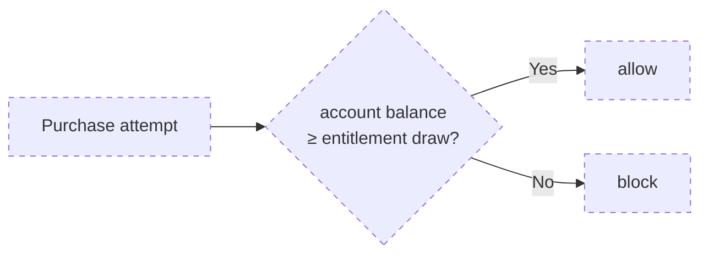

# Flow — Accounts & Top-up

**Files:** `app/(host)/accounts/page.tsx` ·
`components/host/accounts/{account-detail-sections,record-topup-modal,update-balance-modal}.tsx` ·
`components/host/organizations/manual-topup-modal.tsx` ·
`features/accounts/types.ts` · `features/manual-topup/types.ts`

**Status:** viewing works; **top-up and balance edits do not persist.**

> **Naming:** the PRD calls this a "wallet". In code it is `Account` — the
> Wallet→Account rename is complete. A member's "benefit wallet" is a *different*
> concept (entitlement); see [FLOW-entitlement.md](FLOW-entitlement.md).

## Model

`balanceBefore` / `balanceAfter` on every transaction make the ledger auditable —
a balance is reconstructable from history rather than only stored as a total.

An account is **org cash/credit funding**, entirely separate from benefit
entitlement. A claim conceptually settles against an Account while drawing down a
`BeneficiaryUsage`, but **nothing in the code links them** — that reconciliation
does not exist.

## Account List

The nested table was refactored to `<SharedDataTable ghost>` in the May tables
audit — it had been a hand-rolled 12-column CSS grid.

## Top-up

Methods: `bank_transfer`, `cheque`, `credit_card`.
Statuses: `completed`, `pending`, `rejected`.

A parallel `manual-topup-modal.tsx` exists under `components/host/organizations/`
— two entry points onto the same concept.

## The Blocking Rule (specified, not built)

The PRD defines: *"account balance < employee policy entitlement → purchase
blocked."*

Entirely dashed: there is no purchase flow in this repo (it belongs to the member
app), and no code reads an Account balance when evaluating entitlement. Recorded
so nobody assumes the guard exists.

## Gaps

- **Top-up does not persist.** Both modals validate and submit to nothing. The
  `.add()` calls in `app/(host)/accounts/page.tsx` operate on a `Set` of expanded
  row ids, not `accountStore`.
- **Two top-up modals** (`record-topup-modal` under accounts, `manual-topup-modal`
  under organizations) with overlapping purpose.
- **`topupHistory` has a registry entry but no store**, so it cannot be mutated
  even where the UI implies it.
- **Accounts and entitlement never meet.** The blocking rule above is unbuilt, and
  no claim settlement decrements an account.
