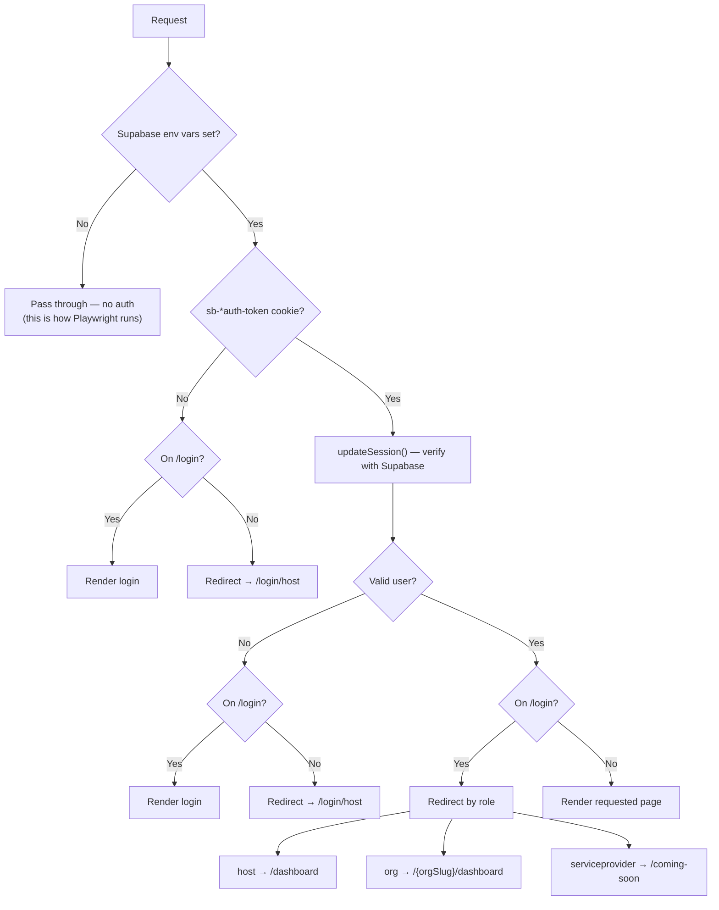
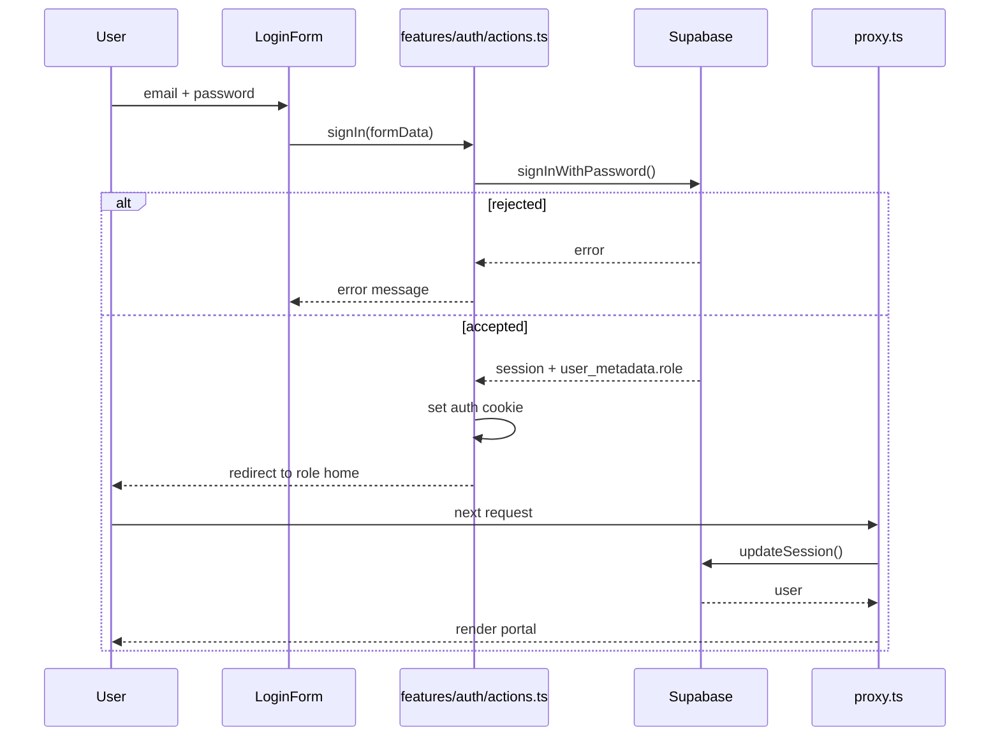

# Flow — Auth & Role Routing

**Files:** `proxy.ts` · `app/(auth)/login/page.tsx` ·
`app/(auth)/login/[role]/page.tsx` · `app/(auth)/signout/route.ts` ·
`features/auth/actions.ts` · `lib/session.ts` · `lib/supabase/middleware.ts`

**Status:** the only flow backed by a **real** service. Everything else is mock.

## Roles

`lib/session.ts` defines three: `host`, `org`, `serviceprovider`.
`login/[role]` maps URL slugs to them:

| URL | Role | Lands in |
|---|---|---|
| `/login/host` | `host` | `app/(host)` — WellUber Admin |
| `/login/organisation` | `org` | `app/(org)/[orgSlug]` — Organisation Admin |
| `/login/serviceprovider` | `serviceprovider` | `/coming-soon` — portal has no pages |

Any other slug hits `notFound()`.

## Route Guard

Two things worth knowing:

**The no-credentials bypass is deliberate.** With `NEXT_PUBLIC_SUPABASE_URL` /
`ANON_KEY` unset, `proxy.ts` passes every request through unauthenticated. The
Playwright `webServer` blanks those vars so e2e tests can reach guarded routes.
It is a test affordance, not a hole to fix.

**`/login/host` is the universal fallback.** An unauthenticated request to any
org-portal URL redirects to the *host* login, not the org one. Known rough edge:
an org admin who bookmarks a deep link lands on the wrong login.

## Sign-in

Role lives in `user.user_metadata.role`; org users also carry
`user_metadata.orgSlug`, which is what makes `/{orgSlug}/dashboard` resolvable.
An `org` user **without** `orgSlug` falls through to the host `/dashboard` — a
misconfigured account silently lands in the wrong portal.
Demo accounts: `scripts/create-demo-accounts.ts`.

Sign-out is `app/(auth)/signout/route.ts` — a route handler calling
`supabase.auth.signOut()`.

## Gaps

- **`serviceprovider` dead-ends at `/coming-soon`.** Handled gracefully, but the
  role exists end-to-end with no portal behind it.
- **No role-based route authorisation.** Verified: `proxy.ts` reads
  `user_metadata.role` **only inside the `user && isLoginPage` branch**, purely to
  choose a redirect. Once authenticated, any role can request any route and the
  proxy passes it through. Fine for a prototype on mock data; must change before
  this fronts real data.
- **Org portal does not verify `orgSlug` ownership.** `/{orgSlug}/…` is taken from
  the URL, so a signed-in org user can read another org's slug by editing the
  address bar. Same root cause as above.
- **No forgot-password / signup.** Accounts are seeded by script only.
