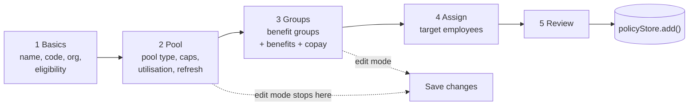
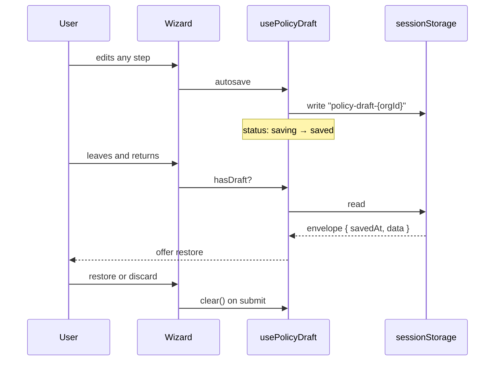
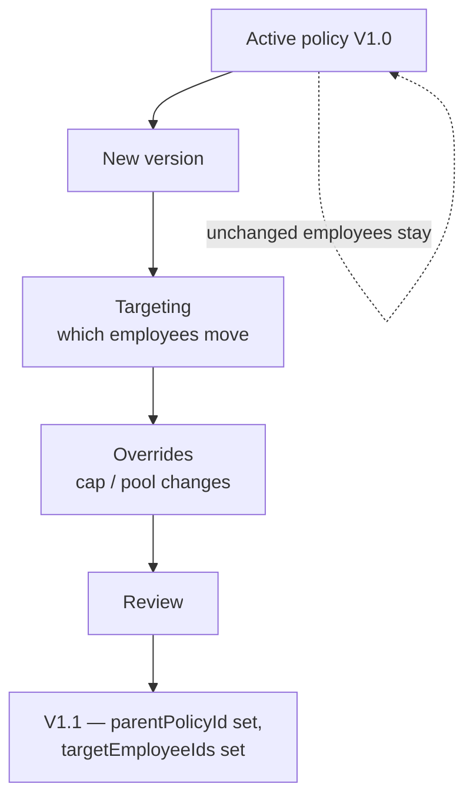

# Flow — Benefit Policy

**Files:** `components/host/policies/benefit-policy-wizard.tsx` ·
`wizard-steps/{basics,pool,groups,assign,review}-step.tsx` ·
`hooks/use-benefit-policy-wizard.ts` (+ `.helpers`, `.types`) ·
`hooks/use-policy-wizard-content.ts` (+ 4 companions) · `hooks/use-policy-draft.ts` ·
`hooks/use-version-wizard.ts` · `lib/policy/integrity.ts`

**Status:** the deepest flow in the product — ~10 hooks. Also the least tested:
no unit tests cover it.

## Creation — 5 Steps

**Edit mode is a different shape.** `benefit-policy-wizard.tsx` renders steps 4
and 5 only when `mode === "create"`. Editing an existing policy exposes Basics /
Pool / Groups and no assignment or review — so assignment can only be set at
creation time or through the version wizard.

## What Each Step Decides

| Step | Sets | Feeds |
|---|---|---|
| **Basics** | `name`, `code`, `organizationId`, `eligibility` (age, gender, tiers, departments) | Who the policy can apply to |
| **Pool** | `benefitPoolType`, `dependentsPoolType`, `dependentCoverages[]`, `totalCapAmount`, `dependentCapAmount`, `utilisationMode`, `refreshCycle` | **The pool kind the entitlement UI resolves** — see [FLOW-entitlement.md](FLOW-entitlement.md) |
| **Groups** | `BenefitGroup[]` → `Benefit[]`, `coverageScope`, `distributionType`, group caps, co-payment | Per-group ceilings |
| **Assign** | `assignedEmployeeIds[]`, `assignmentOrgId` | Which employees hold it |
| **Review** | nothing — read-only confirmation | |

The Pool step is the one that matters downstream: `benefitPoolType` and
`dependentsPoolType` together determine which of the four pool kinds every
entitlement view will render.

## Draft Persistence

Keyed per org (`policy-draft-{orgId}`, or `global`), so drafts for different orgs
do not collide. Cleared on successful submit.

## Versioning

`app/(host)/policies/[id]/versions/new` — a separate 3-step wizard
(`version-wizard-steps/`): **Targeting → Overrides → Review**.

`BenefitPolicy` carries `version`, `parentPolicyId`, `targetEmployeeIds`, so a
version is a real policy row linked to its parent rather than a mutation of it.

## Integrity Checks

`lib/policy/integrity.ts` validates group/benefit referential consistency —
`policyGroupIds` maps each policy to its group id set and flags benefits pointing
at groups that do not belong to their policy.

## Gaps

- **No unit tests.** The largest, most branch-heavy flow in the repo has zero
  coverage. Anything refactoring these hooks is flying blind.
- **Assignment is create-only.** Editing a policy cannot change who holds it;
  that requires the version wizard, which is not an obvious path.
- **Draft is `sessionStorage`.** Closing the tab loses the draft — no warning.
- **`framer-motion` in `benefit-policy-wizard.tsx` and `wizard-shared-ui.tsx`.**
  The `mode="wait"` variant is a known hang in this app; these are among the ~10
  remaining usages flagged in the August snapshot.
- **Policy → employee assignment does not write entitlement.** Assigning a policy
  updates the policy record; the entitlement fixtures in
  `employee-entitlements-mock.ts` are keyed separately by employee id, so a newly
  assigned employee shows no pools.
