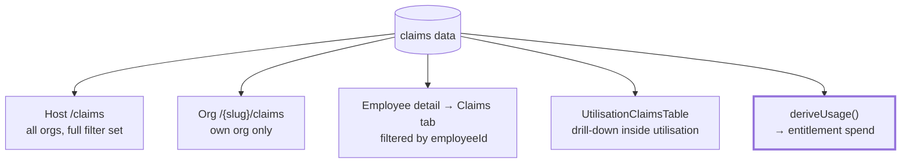
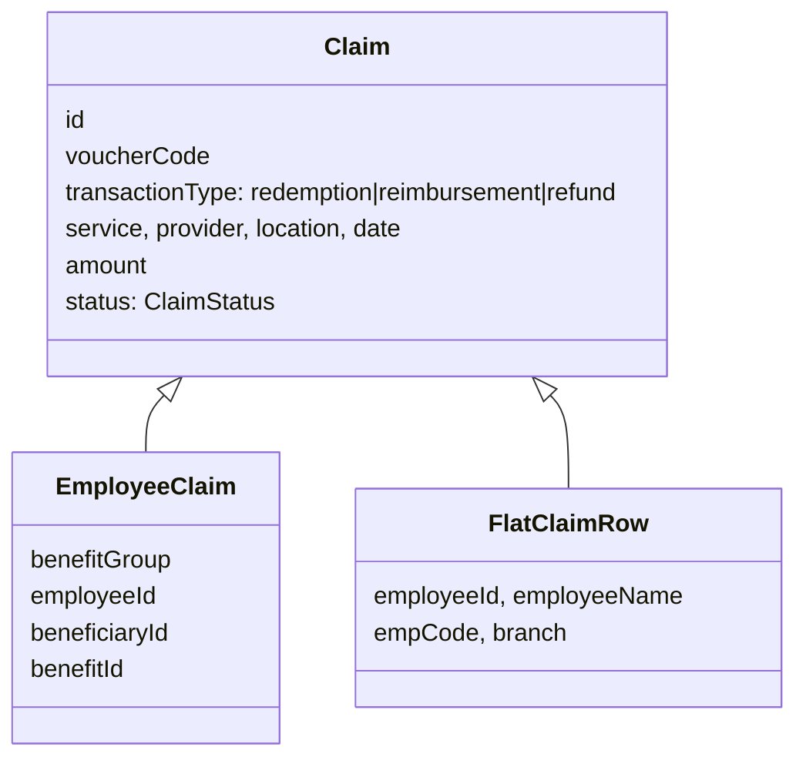
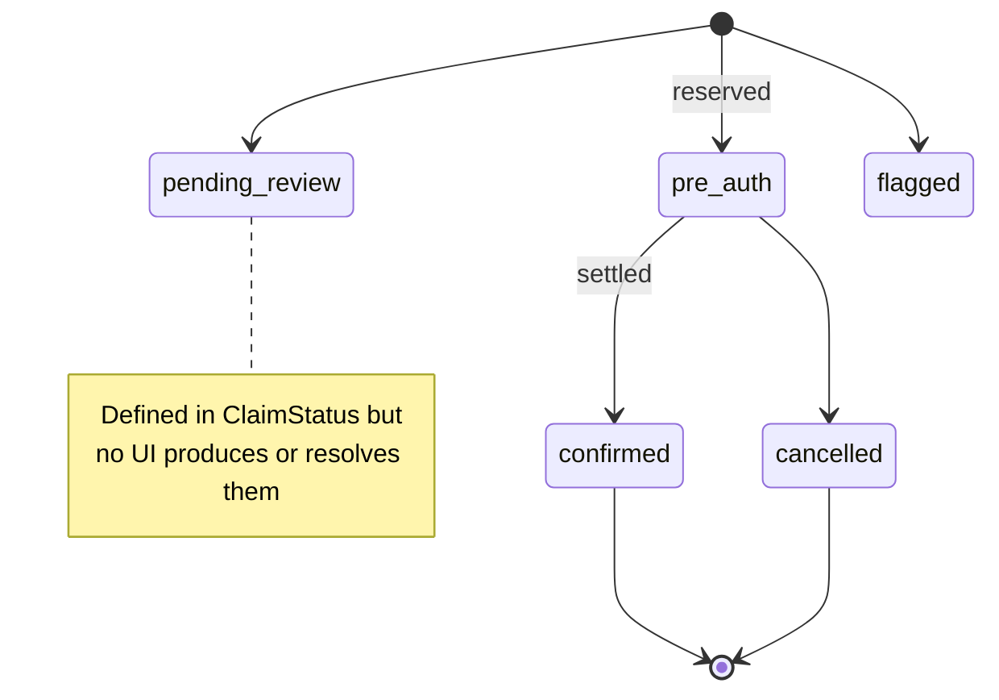
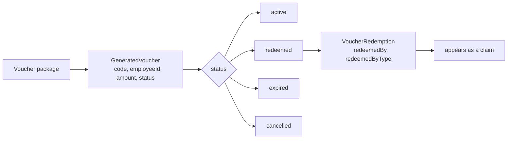

# Flow — Claims & Vouchers

**Files:** `app/(host)/claims/page.tsx` · `app/(org)/[orgSlug]/claims/page.tsx` ·
`app/(org)/[orgSlug]/vouchers/page.tsx` ·
`components/host/employees/employee-{claims,vouchers}-tab.tsx` ·
`components/shared/{vouchers-table,voucher-detail-sheet,organization-claims-table}.tsx` ·
`types/claims.ts`

**Status:** **read-only throughout.** There are no state transitions anywhere.

## Where Claims Appear

The thick edge is the important one: claims are not just a report. They are the
**ledger entitlement spend is derived from**. Editing a claim amount changes what
the Entitlement tab shows — there is no separate spend figure to update.

## Claim Shape

`employeeId` + `beneficiaryId` + `benefitId` on `EmployeeClaim` are what make
per-employee filtering and derived spend possible. Before they existed, every
employee's Claims tab showed the same rows.

## Status — Defined vs Used

`ClaimStatus` declares five values. Only three appear in fixtures. `pending_review`
and `flagged` have **no transition path** — nothing creates them and nothing
clears them.

For entitlement, `confirmed` and `pre-auth` **consume** budget; `cancelled`,
`pending_review`, `flagged` do not.

## Vouchers

`redeemedByType: Employee | Dependent` mirrors the beneficiary split entitlement
uses. Voucher packages live under host `/voucher-packages/[id]/vouchers`.

## Gaps

- **No claim actions.** Row actions in `app/(host)/claims/page.tsx` are literally
  `onClick: () => {}`. Approve / reject / flag do not exist, so two of the five
  declared statuses are unreachable.
- **Read-only end to end.** No claim or voucher can be created, edited, or
  transitioned from the UI.
- **Two `VoucherRedemption` types.** One in `types/claims.ts`
  (`employeeId`, `employeeName`, `empCode`), another in
  `features/employees/types.ts` (`category`, `benefitType`, `redeemedByType`).
  The tabs import the latter. They should be reconciled.
- **Global vs per-employee claim sets are separate.** `MOCK_CLAIMS` (10 rows,
  `GlobalClaimRow`) and `MOCK_EMPLOYEE_CLAIMS` (31 rows, `EmployeeClaim`) are
  different datasets. Only the second drives entitlement, so host `/claims`
  totals and employee entitlement do not reconcile.
