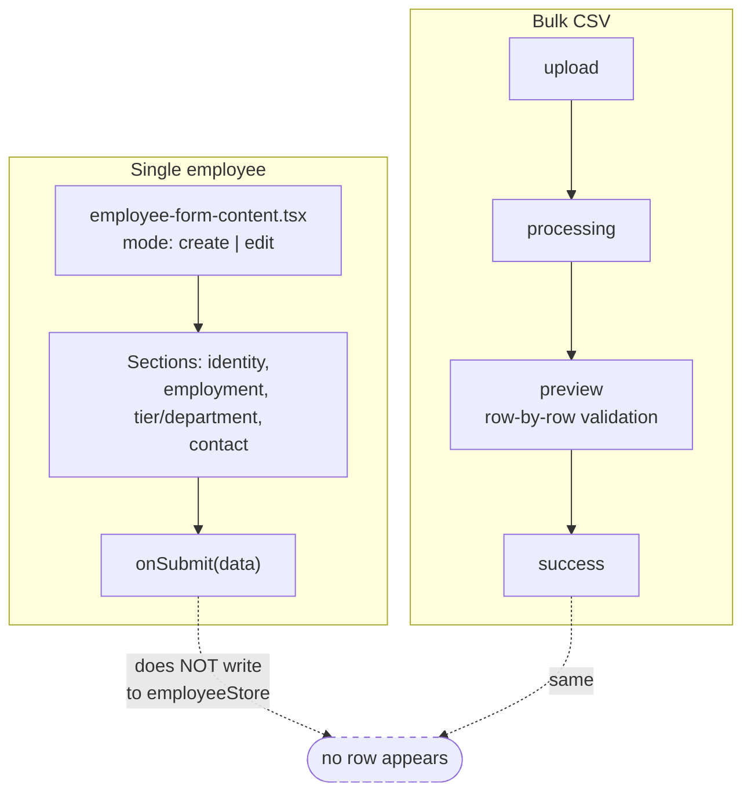
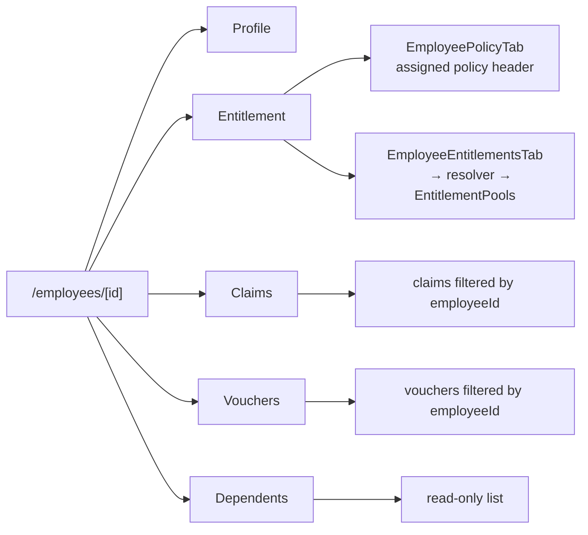
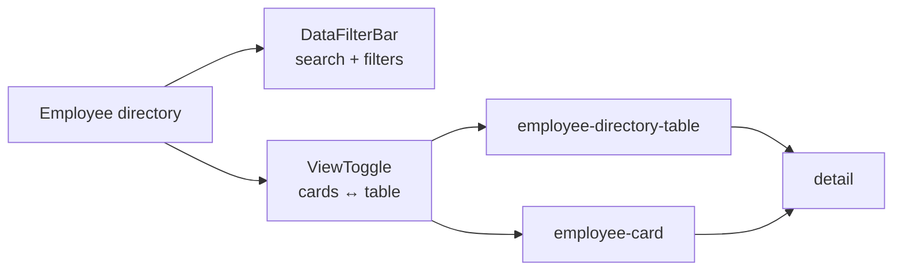

# Flow — Employee Management

**Files:** `components/host/employees/employee-form-content.tsx` ·
`employee-detail.tsx` · `employee-directory-table.tsx` ·
`hooks/use-bulk-upload-wizard.ts` · `app/(org)/[orgSlug]/employees/new/page.tsx`

**Status:** browsing and viewing are complete; **creating is not persisted**.

## Two Entry Paths

`use-bulk-upload-wizard.ts` defines a clean 4-stage machine —
`upload → processing → preview → success` — with a per-row preview so bad rows
can be seen before commit. It is the better-designed of the two paths.

## Employee Detail — 5 Tabs

Claims and Vouchers stay **separate tabs by design** — not to be merged into an
Activity tab.

Both used to call `void employeeId` and render the same rows for every employee.
They now filter, which required adding `employeeId` to `EmployeeClaim` and
`VoucherRedemption` — see [FLOW-entitlement.md](FLOW-entitlement.md) for why that
field also made spend derivable.

## Directory

Host reads the whole roster; org portal filters to its own org. Note
`hooks/use-org-workforce.ts` takes an `orgId` and `void`s it — the filtering
happens in the page, not the hook.

## Gaps

- **Create does not persist.** `onSubmit` receives validated data and does not
  call `employeeStore.add()`. Same for the bulk wizard's success stage. You can
  complete either flow and no employee appears.
- **`mode` is ignored.** `employee-form-content.tsx:68` does `void mode`, so
  create and edit render identically — no edit-specific affordances.
- **Dependents are read-only.** The tab lists `employee.dependents` with a proper
  empty state, but there is no add / edit / remove anywhere in the product,
  despite dependents driving half the entitlement pool kinds.
- **Two dependent ID schemes.** `factories/dependent.ts` emits
  `DEP-20260115-0001`; the entitlement fixtures use `DEP-0002-1`. The Dependents
  tab and the entitlement beneficiary rows therefore describe different people.
- **Assigning a policy does not create entitlement.** Entitlement fixtures are
  keyed by employee id independently of policy assignment, so a newly assigned
  employee shows an empty state.
