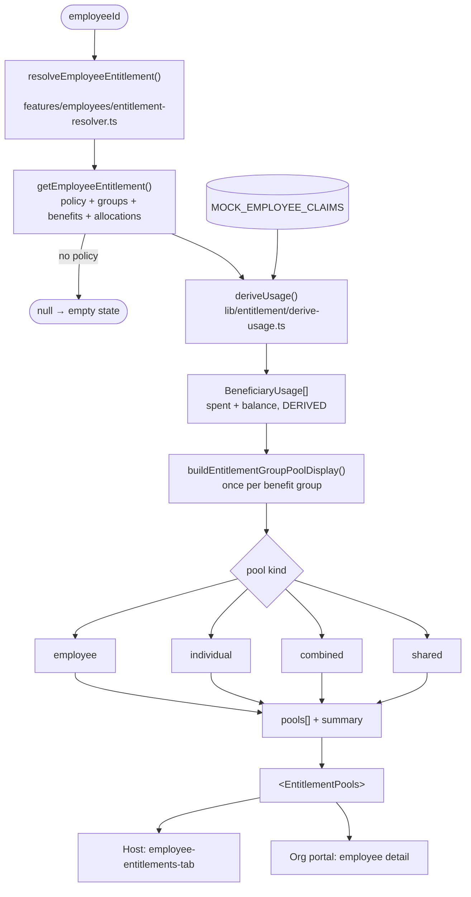
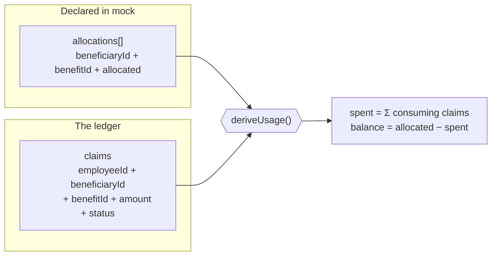
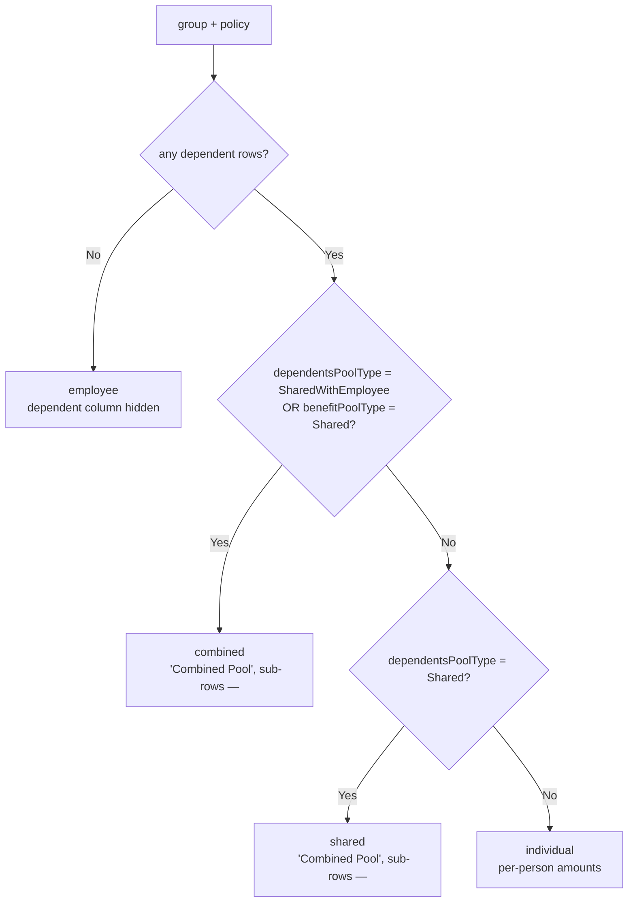

# Flow — Entitlement Resolution

**Files:** `features/employees/entitlement-resolver.ts` ·
`features/employees/entitlement-pool-display.ts` ·
`lib/entitlement/derive-usage.ts` ·
`components/shared/entitlement-pools.tsx` ·
`components/host/employees/employee-entitlements-mock.ts`

**Status:** consolidated August 2026. This is a **data flow**, not a user journey
— it is what happens when any entitlement view renders.

> **Rules of the road.** One calculation, one entry point, one component, four
> pool kinds. Full detail in `../ENTITLEMENT_PAGE_STRUCTURE_SPEC.md`.

## The Pipeline

Host and org portal enter at the same node, so they cannot report different
numbers for the same employee. Before consolidation they had separate
calculations and separate renderers, and did.

## Spend Is Derived, Never Declared

**Consuming statuses:** `confirmed` and `pre-auth`. Pre-auth counts because the
funds are reserved — excluding it would let the same ringgit be spent twice.
`cancelled`, `pending_review`, `flagged` do not consume.

This is why an employee's Claims tab total now equals their entitlement `used`.
It previously did not: spend was hand-typed and contradicted the claim ledger.

## Choosing The Pool Kind

The `benefitPoolType = Shared` branch is easy to miss and was a real bug: without
it an org shared-pot policy fell through to `individual` and counted one 2,000
pool as each beneficiary's own allocation (reporting 4,000).

## Ceiling Precedence

Two rules at two scopes — deliberate, not duplication:

| Scope | Function | Order |
|---|---|---|
| One group | `sharedAllocated()` | `group.dependentGroupCap` → `policy.dependentCapAmount` → sum |
| All groups | `getSharedDependentPoolCeiling()` | `policy.dependentCapAmount` → sum of group caps → fallback |

Group scope: the group's own cap is more specific, so it wins. Policy scope:
`dependentCapAmount` *is* the total, so summing group caps would over-report.

`capToPolicyCeiling()` additionally clamps any single group to
`policy.totalCapAmount` — without it a combined pool reported the sum of its
benefits (1,600) while the summary reported the cap (800), on one screen.

## Fixture Coverage

Six employees, all four kinds:

| Employee | Pool kind |
|---|---|
| Robert Fox `0001` | `employee` — no dependents |
| Jenny Wilson `0002` | `individual` |
| Michael Tan `0003` | `combined` (SharedWithEmployee) |
| Marvin McKinney `0004` | `shared` |
| Jason Teh `0005` | `combined` (org shared pot) |
| Ahmad Faizal `0006` | `individual`, **6 dependents** — stresses the colour ramp |

## Gaps

- **`entitlements-sub-tab.tsx` bypasses this pipeline**, reading
  `MOCK_ENTITLEMENTS` directly, so the org Entitlements roster does not reconcile
  with employee detail. Needs a batch resolver.
- **`individual` summary asymmetry:** `summary.allocated` counts only the
  employee ceiling while `summary.used` includes dependent spend. Ahmad reads
  5,000 / 2,490 / 2,510 — matching the spec wireframe — but his groups allocate
  8,600 once each dependent wallet is counted. Unresolved product question.
- **Two dependent ID schemes.** This pipeline uses employee-scoped ids
  (`DEP-0002-1`); `factories/dependent.ts` emits `DEP-20260115-0001`. Nothing
  joins them.
- **Entitlements have no store or registry entry**, so nothing here is editable.
