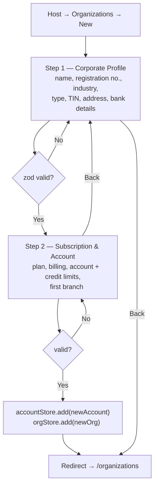
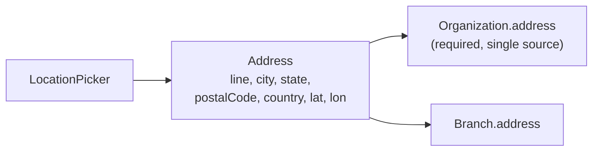
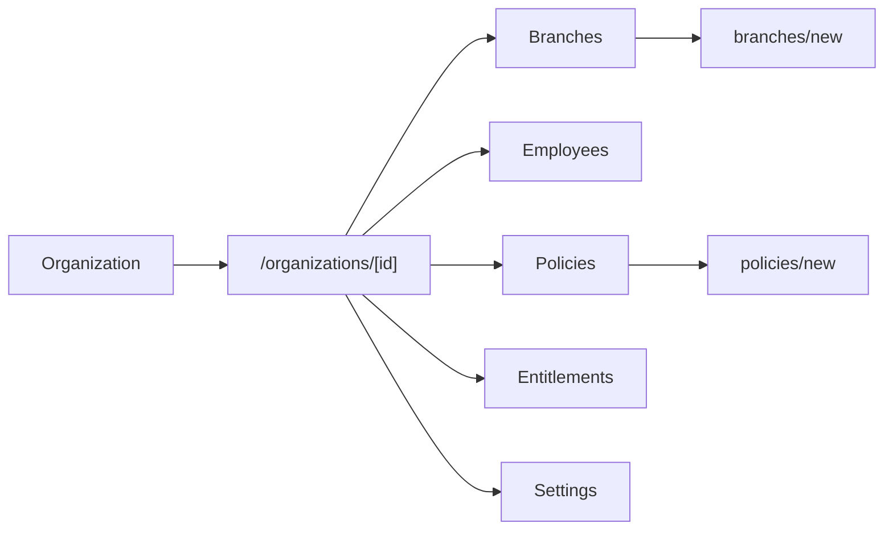

# Flow — Organization Onboarding

**Files:** `app/(host)/organizations/new/page.tsx` ·
`components/host/organizations/new-organization-step-two.tsx` ·
`features/organizations/schemas.ts` · `lib/mock-data/store.ts`

**Status:** one of the few flows that **actually persists**. Writes to both
`orgStore` and `accountStore`.

## The Flow

Order matters: the **account is created before the organization**, so the org row
can reference a funded account from the moment it exists.

## Why Two Steps

Step 1 is legal identity — the things that make the org a company. Step 2 is
commercial setup — plan, funding, first branch. `FloatingAnchorNav` supplies
per-step jump links (`STEP1_ANCHORS` / `STEP2_ANCHORS`) because both steps are
long forms.

There is a comment in `page.tsx` worth preserving: validation failures must be
surfaced, otherwise *"the step silently refuses to advance with no visible
reason."* That was a real bug once.

## Address

Uses the consolidated `Address` type (`types/address.ts`) —
`line / city / state / postalCode / country` plus flat `lat` / `lon`. Captured by
`LocationPicker`.

`Organization.address` is required and is the only address source — the legacy
flat `state` / `country` fields were removed.

## Post-Creation

Org detail tabs are flat — no nested sub-tabs, resolved in an earlier audit.

## Gaps

- **`LocationPicker` error text is incomplete.** Only `line` renders a message;
  `city`, `postalCode`, `state`, `country` get a red border and no explanation.
  In a two-step wizard that blocks advancement, this is the exact "silently
  refuses to advance" failure the code comment warns about — just moved down a
  field.
- **`"Wilayah Persekutuan"` is missing from `LocationPicker`'s state list.** Acme
  uses it, so loading Acme into that form renders a blank state field.
- **Branch creation does not create an account.** Org creation does; adding a
  branch afterwards through `branches/new` does not follow the same pattern.
- **Edit does not mirror create.** `organizations/[id]/edit` exists but does not
  go through the two-step shape, so field validation differs between the paths.
