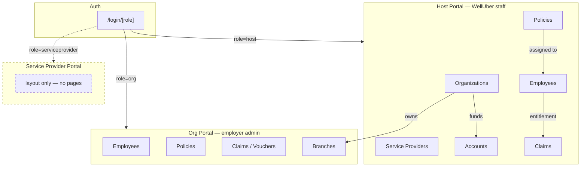
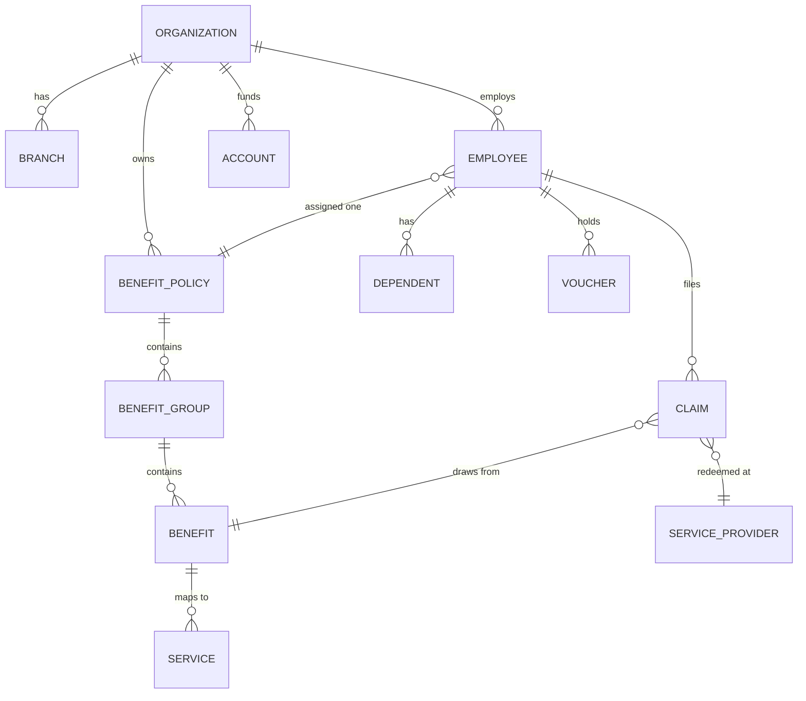

# Module Flows — Index

Flows for **what this repo actually contains**: the WellUber admin console
(host + org portals) running on mock data.

> **Written from the code, August 2026.** An earlier `docs/flows/` set was deleted
> in `5711ca0` for describing the full product — member app, SP portal, purchase,
> redemption, settlement — none of which exists here. These replace it and cover
> only implemented journeys.
>
> **Scope rule:** if it is not in `app/(host)` or `app/(org)`, it is not in here.
> Product-level flows for unbuilt surfaces belong in the PRD, not in this folder.

## Flows

| Flow | Module | Status |
|---|---|---|
| [Auth & role routing](FLOW-auth.md) | `app/(auth)`, `proxy.ts` | Real (Supabase) |
| [Organization onboarding](FLOW-organization-onboarding.md) | Host → Organizations | 2-step wizard, persists |
| [Benefit policy](FLOW-benefit-policy.md) | Host → Policies | 5-step wizard + versioning |
| [Employee management](FLOW-employee-management.md) | Host + Org → Employees | Single form + bulk CSV |
| [Entitlement resolution](FLOW-entitlement.md) | Shared | Data flow, consolidated Aug 2026 |
| [Claims & vouchers](FLOW-claims-vouchers.md) | Host + Org | Read-only |
| [Accounts & top-up](FLOW-accounts.md) | Host → Accounts | Modals, partial persistence |

## System Map

The Service Provider portal is scaffolding — `app/(serviceprovider)/layout.tsx`
with no pages and an empty `components/sp/`. Login accepts the role and routes
nowhere. Shown dashed above so nobody plans against it.

## Entity Relationships

**The join that matters:** a `CLAIM` carries `employeeId` + `beneficiaryId` +
`benefitId`. That triple is what makes entitlement spend derivable rather than
hand-typed — see [FLOW-entitlement.md](FLOW-entitlement.md).

## Conventions Used Here

- **Solid arrows** = implemented and reachable in the UI.
- **Dashed arrows / nodes** = scaffolded, stubbed, or not persisted.
- Every flow names the files it was read from, so it can be re-verified.
- Where a flow does not persist, it says so. Most create/edit screens in this
  prototype render and validate but do not write to a store.
